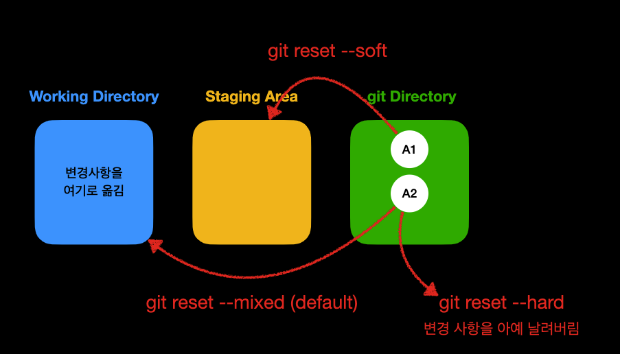

- 09:00 ~ 11:46 깃허브 특강]
- DONE Git 정리 작업 필요
  :LOGBOOK:
  CLOCK: [2023-06-27 Tue 23:35:42]--[2023-06-28 Wed 14:55:54] =>  15:20:12
  :END:
	- 
		- ((64991dd9-dc90-496f-a013-2ce23c641f7e)) #git
			- git add {파일명} 으로 추가 할 수 있음
			- git add . -> . 은 변경된 전체 파일 사항을 Staging Area로 옮김
			- git restore --staged {파일명} -> 다시 Untracked files로 옮길 수 있음
		- ((64991e45-a9dc-4bc4-bdb2-bf567b955ccc)) #git
			- git commit --amend를 사용해서 커밋 한 수정가능
			- 이미 올려버렸다면 강제 푸시 (git push -f)가 불가피함
		- ((64991f06-6c0a-4ebf-98f6-6715d31db518)) #git
			- 1. .gitmessage.txt (이름은 자유) 파일을 생성한다 (vi .gitmessage.txt) → 단일 프로젝트에 적용
			  1-1. 파일을 생성하되 (vi ~/.gitmessage.txt) 로 기입 시에는 전체 프로젝트에 적용
			- 2. i로 수정 모드로 변경 후 원하는 템플릿을 작성한다
			  (템플릿은 찾아보면 많이 나옵니다)
			- 3. 작성 후 :wq + enter를 눌러 작성한 템플릿을 파일에 저장한다.
			- 4. git config commit.template .gitmessage.txt 명령어를 통해 템플릿으로 등록한다
			  → 단일 프로젝트에 적용
			  4-1. git config --globla commit.template ~/.gitmessage.txt로 템플릿 등록
			  → 전체 프로젝트에 적용
			- 5. git config --list를 통해 템플릿이 잘 등록되었는지 확인
			- 6. 커밋 템플릿을 제거하려면 git config --unset --global commit.template
			- ((64991f9c-9471-40a8-9c83-0909f4dc9acd))
				- http://karma-runner.github.io/6.4/dev/git-commit-msg.html
				- 이러한 규칙을 사용하는 경우도 있고 이에 대한 Convention 정해서 하면 좋다.
		- ((6499208e-6d6f-4c19-b7e5-b287ff692cd0))
			- git 버전 관리에서 제외할 파일 목록을 지정하는 파일
			- https://www.toptal.com/developers/gitignore
			- ((6499213d-162b-4048-9e79-35dea85bd22e))
			- ((64992165-a108-4f51-8fbe-f91558835cdf))
		- ((6499218c-9ff6-4ace-a63c-647a2e7aa7d3))
			- git switch {브랜치} 로 checkout 에서 변경 됨
			- git checkout {커밋 해시코드} → 요건 그대로 사용
			- git restore {파일명}
			- git restore --staged {파일명}
		- ((649921a0-0657-4054-9b4b-574aa80b934c))
		- ((649921af-6e63-4ec6-ae1d-5e3f20ea57e6))
			- git reset HEAD ~2
			- git reset {해시값}
				- {:height 249, :width 431}
		- ((649921b5-fa19-4aad-af5d-4cb370d5e0a5))
		- ((649921bc-5954-4c36-8b27-8be315e99631))
			- 그러면 다시 이전 커밋으로 돌아갔다는 커밋이 찍힌채로 되돌아가게 된다
		- ((649921c5-5ba9-4788-9047-a24322eb76d4))
		- ((649921cb-de60-468e-8d1f-d10a6e3bdb13))
			- ((64997e42-4ee1-45f1-a01e-f0df1fbfaf61))
				- git push -f
		- ((649921e0-ce54-4838-a34c-45d42e432e72))
			- ((649993ec-3437-426e-a226-5350c4f502fc))
			- git stash pop : Stash List에서 가장 최근 저장 내용을 제거하면서 내용을 불러옴
			- git stash apply : Stash List를 그대로 두고 가장 최근 저장 내용을 불러옴
			- git stash drop : Stash List에서 가장 최근 저장 내용을 제거
			- git stash clear : Stash List를 전부 제거
		- ((6499810b-250e-48e3-82d1-db35b3830e54))
			- git fetch VS git pull
			- git fetch -> 패치만 진행하고
			- git pull -> 실제로 해당하는 업데이트 하는 작업을 수행함. (merge 작업까지)
		- ((64999512-003c-465b-bae9-573098f44d80))
			- 리모트에서 Merge 전, 소스코드의 변경사항을 다른 개발자들에게 공유하고 리뷰를 받을 수 있도록 함
- 12:59 ~ 18:00 수업
	- 가위바위보 게임 만들기
- 18:45~ 19:40 런닝 6km 39? 40분
- 10km 1km 5분 가볍고 잘뛰어야함 ㅋㅋ
- 20:00 ~ 22:40 git study
	-
		-
- DOING #swift 노션 정리 진행
  :LOGBOOK:
  CLOCK: [2023-06-26 Mon 21:13:08]--[2023-06-27 Tue 19:55:35] =>  22:42:27
  CLOCK: [2023-07-06 Thu 21:02:03]
  :END:
- DOING #logseq logseq 정리법 및 사용 방법 정리
  :LOGBOOK:
  CLOCK: [2023-06-29 Thu 18:07:53]
  :END:
	- https://blog.minamiland.com/749
-