- LogSeq 도움말 및 정리 -> 단축키
- 어떻게 사용 할 것인가?
- DOING 나만의 로그시크 템플릿 + 일상의 목록 정리 하여 생성하기
  :LOGBOOK:
  CLOCK: [2023-07-06 Thu 21:02:00]
  :END:
-
- [[독서]]
  template:: ReadBooks
  collapsed:: true
	- 책_제목::
	- 책_분야::
	- 읽은_페이지::
-
- 오늘 09:00 - 10:00
- # Github Pages
- ### github 페이지 만들기
-
- 10:00 - 12:00
- ## [[Human Interface Guideline]] #Design
  collapsed:: true
	- ### 왜 HIG가 중요한가? #why
		- 애플에서 개발자에게 권하는 인터페이스 가이드라인 [[인터페이스]]
		- 반드시 지킬 필요는 없으나 되도록 이에 따르는 것이 좋음.
		- 과하게 사용성이 모자라는 경우 앱 심사 단계에서 보정권고를 받음
	- ### [[Layout]]의 목표
		- 다양한 맥락에서도 통일된 레이아웃을 유지하면 콘텐츠에 대한 접근성이 높아짐 (- [[tone & manner]])
		- 이렇게 높아진 접근성은 여러분들이 만든 앱이나 게임에 대한 사용 경험을 더 즐겁게 해 줄 것.
	- ### [[Safe Area]]
		- 네비게이션바, 탭바, 툴바 혹은 화면 안에서 필수로 제공해야 하는 요소들을 제외한 영역을 말함.
		- 예를 들어 아이폰의 다이나믹 아일랜드, 일부 맥의 카메라 하우징 영역과 같이 인터렉션을 위해 반드시 비워놔야 하는 영역
		- SwiftUI, UIKit의 AutoLayout을 사용 할 때 다양한 화면 맥락에서도 안전 영역을 보장 할 수 있음.
		- ### Safe area 확보로 보호 받을 수 있는 요소의 예시)
			- 각 디스플레이 크기와 해상도, 색공간에 따른 차이
			- 다양한 기기 정렬 방법에 따른 UI요소 표시 (세로 또는 가로 모드)
			- 멀티태스킹을 위한 스플릿 뷰
			- 아이패드 상에서 외장 디스플레이 지원, 화면 확대기능, 멀티태스킹 모드
			- 동적으로 UI요소의 글씨 크기가 변하는 상황
			- 로케일에 따른 다국어 요소(좌우 혹은 우좌 쓰기 등), 날짜 및 시간 표시방법, 폰트 스타일, 글자 길이 등
			- iOS 혹은 Mac OS에서 제공하는 시스템 기능
		- 이해를 위한 사진
		  collapsed:: true
			- 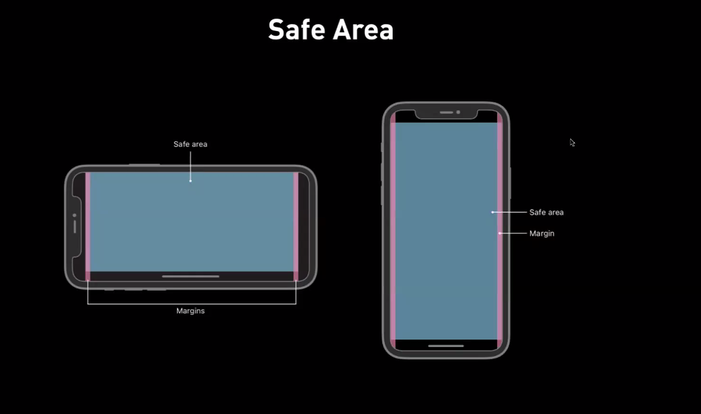
			- 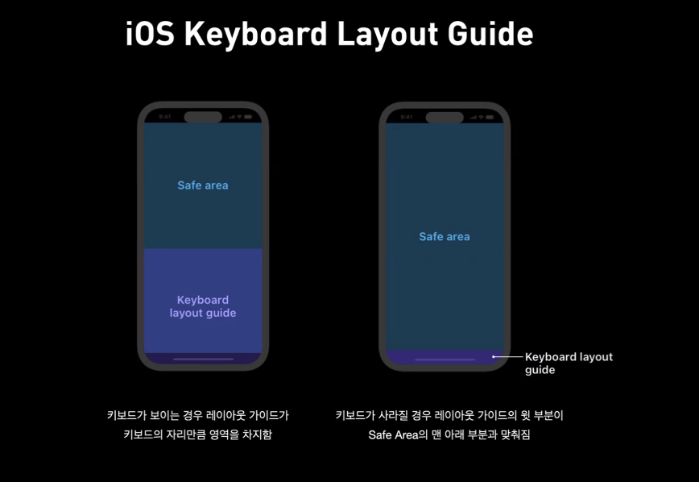
			- 지키지 않으면 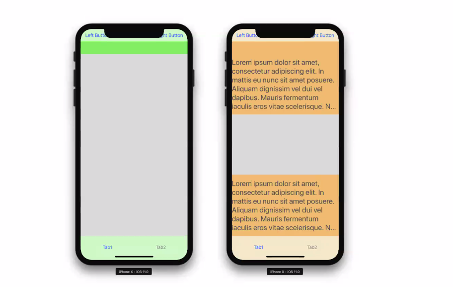
				-
	- ### Apple의 권장 사항
		- 앱을 제작하면서 맥락에 따라 다양한 상황을 주고 콘텐츠가 모든 모드에서 올바르게 동작하는가 테스트 할 것. (최대한 많은 맥락에서 테스트를 진행 해보아야 한다.)
		- 플랫폼마다 화면 안에서 표시해 줄 주요 요소들을 우선적으로 고려 할 것.
		  (ex. portrait , landscape 혹은 iPad -> MacOS 시 등등..)
		- 화면 내의 상대적 중요도를 고려해서 요소를 배치 할 것.
		- 요소의 중요도에 따라 요소 크기를 배분하여 표시 할 것.
		- 시각적 그룹핑을 통해 사용자가 원하는 정보를 찾기 쉽도록 만들 것.
		- 관련 있는 요소끼리 정렬시켜 요소 간의 위계와 관계성을 알아보기 쉽게 할 것.
		- 화면 크기에 따라 이미지 등이 잘리거나 크롭되지 않도록 [[요소 컨테이너]]의 종횡비를 고려 할 것.
		- 글자 크기가 바뀌는 상황을 고려할 것.
		- 화면을 넘어가는 큰 요소들에는 반드시 스크롤 되고 있다는 시각적 암시를 줄 것.
		- 터치스크린 버튼 요소에서 최소 44x44 포인트의 크기를 보장 할 것
	- ### iOS [[Keyboard Layout Guide]]
		- #+BEGIN_QUOTE
		  왜? 
		  - TextField 내의 텍스트 작성을 하려면 키보드가 올라오는데 이것이 디자인이나 버튼을 가림
		  #+END_QUOTE
		- 키보드가 보이는 경우 레이아웃 가이드가 키보드의 자리만큼 영역을 차지함.
		- 키보드가 사라질 경우 레이아웃 가이드의 윗부분이 Safe Area의 맨 아래 부분과 맞춰짐
		- iOS 15부터 키보드 레이아웃 가이드라는 부분이 이미 영역을 차지 하고 있어서
		  self.keyboardLayoutGuide 의 바닥면을 기준으로 [[AutoLayout]]을 설정할 경우에 키보드가 올라와도 해당 버튼이 올라옴.
		- 이해를 위한 사진
		  collapsed:: true
			- 
			- 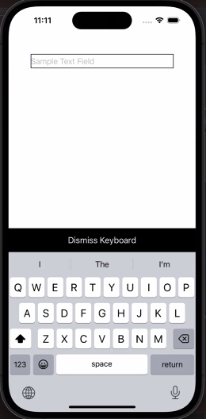
				-
				-
	- ### HIG - [[SF Symbols]]
		- #+BEGIN_QUOTE
		  **SF Symbols** 
		  Apple San Francisco와 완벽히 상응하는 스타일의 심볼 글리프 전용 폰트
		  #+END_QUOTE
		- ### Benefits of dingbat fonts
			- 다양한 아이콘(심볼) 크기에 대응 가능
			- 다양한 웨이트에 대응이 가능
		- ### SF Symbols Exclusive Features
			- 단색, 계층적 컬러, 팔레트, 멀티컬러 기능 지원
			- 사진
			  collapsed:: true
				- 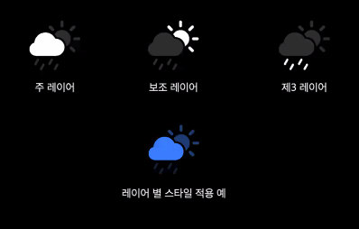
					-
		- ### SF Symbols Render Modes - Monochrome
			- 심볼의 모든 레이어에 동일한 색상을 입히는 것으로 특정 색을 지정할 수 있거나
			  색상이 입혀진 심볼에 투명도를 적용 할 수 있음.
			- 사진
			  collapsed:: true
				- 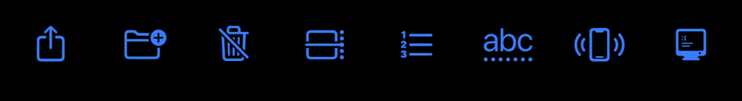
		- ### SF Symbols Render Modes - Multicolor
			- SF Symbols 2 (2020) 에서부터 사용 가능한 기능
			- 심볼의 의미를 강조하기 위해 특정한 심볼에만 특정한 색을 입혀 놓은 모드
			- 특정한 멀티컬러 심볼은 주 색상을 변경 가능함.
			- 사진
			  collapsed:: true
				- 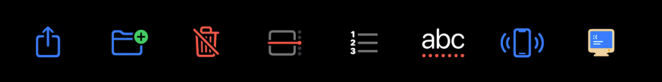
		- ### SF Symbols Render Modes -  Hierarchical
			- SF Symbols 3 (2021) 에서부터 사용 가능한 기능
			- 단색 컬러를 심볼에 부여하되, 심볼 요소의 계층 레벨에 따라 색상의 투명도를 설정해 줄 수 있음.
			- 사진
				- 없음.. 채우자
		- ### SF Symbols Render Modes - Palette
			- SF Symbols 3 (2021) 에서부터 사용 가능한 기능
			-
			- 사진
			  collapsed:: true
				- 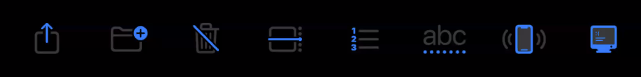
		- ### Variable Color
			- SF Symbols 4 (2022) 에서부터 사용 가능한 기능
			- variableValue 값에 따라 아이콘 색상의 상태가 변화
			- 사진
			  collapsed:: true
				- 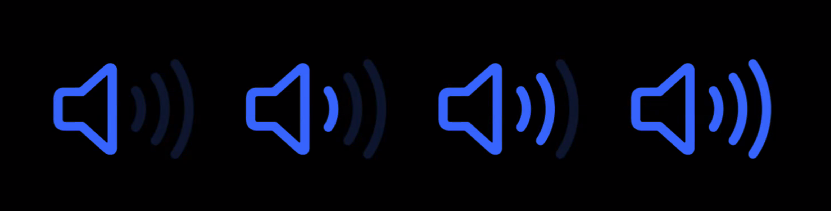
					-
		- ### Variable Weights and Scales
			- 사진
		- ### Variable Cap Height between sizes
			- 사진
		- ### Custom Symbol
			- SF Symbols에서 제공하지 않는 고유한 심볼을 만들어 앱에 사용 할 수 있음.
				- 단순해야 함
				- 심볼로써 의미를 인식 가능해야 함
				- 포괄적인 모양이어야 함
				- 지정하고자 하는 동작이나 내용과 직접적으로 관련 있어야 함
	- ### HIG -
		- ### Point
			- 기기의 해상도에 따라 그때 그때 다른 추상적인 측정 단위
			- 시각적 콘텐츠가 일관성을 유지하는 데 도움이 됨
			- 절대 해상도 값을 적용하기 위해서는 [[Scale Factor]] 를 지정하면 됨.
		- ### [[Scale Factor]]
		  collapsed:: true
			- Assets 파일에 가보면 이미지에 대한 크기 요소
				- 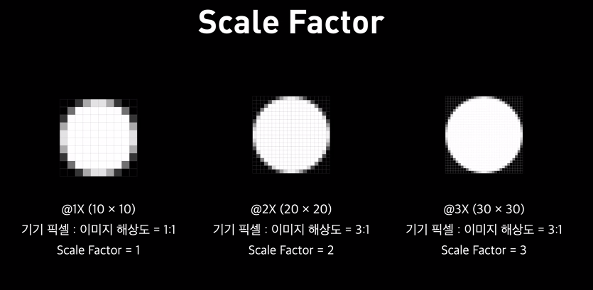
				  collapsed:: true
					-
		- 애플의 권장 사항
		  collapsed:: true
			- 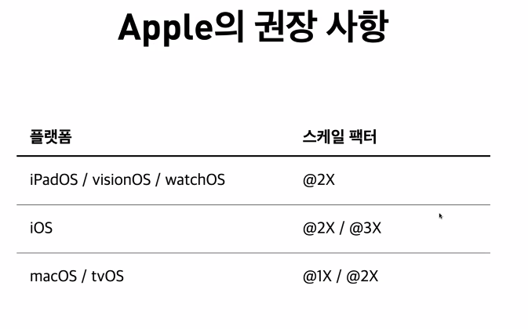
				-
- 13:05 -
- ClosureCalcUI를 만들어보자 뭐로? #swiftUI
- struct에 CustomStringConvertible
- ViewBuilder
- Hashable, Equatable, CustomeStringConvertible (프로토콜 사용이유)
-