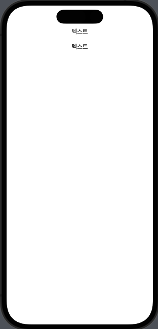

- 어제 푹 쉬었으니까 오늘 열심히 하장~
- [[독서]]
  collapsed:: true
	- 책_제목:: 다정한 말이 똑똑한 말을 이깁니다.
	- 책_분야:: 화술, 자기개발
	- 읽은_페이지:: 24p
	- 내용:: 다정한 말로
- 08:55 ~ 수업 on 오늘의 주제 : [[Struct]] [[Protocol]]
	- 객체 지향
		- - " 테슬라 모델X는 전기차의 특성을 다 갖고 있다"
		- - " 전기차는 자동차의 특성을 다 갖고 있다"
		- => "나를 정의하는 것은 내가 누구의 후손인지에 달려있다"
		  => "나는 유일무이한 나리는 존재이다" -> 메모리에서 딱 한개만 있다 (참조타입)
		  -> 사용하려는 함수가 있다면, 그 위치만 알려줘서 가서 직접 처리하게 함
		  -> 그럼 동시에 여러 곳에서 하나의 데이터를 건드리다보면? 사고가 남... (DeadLock)
		- Class
		- 캡슐화 (은닉화)
		- 상속
		- 다형성
	-
	- 프로토콜 지향
	- "테슬라 모델X는 충전, 자율주행, 뒷문이 팔콘, SUV"
	  -"람보르기니는 내연기관, 2도어, 고급유, ...
	- "홍길동 E N F PI
	  => "나를 정의하는 것은 나의 행동들에 달려있다"
	  => "나와 똑같이 행동하는 녀셔석이 여럿 생기면 나랑 같잖아" -> 메모리에서 무한 복제 (값타입)
	  -> 사용하려는 함수가 있다면, 똑같은 내용을 복제 떠서 넘겨줌 (값타입)
	-
	- 스위프트 프로퍼티 래퍼 + Swift Macro
-
- UI 달력 그리기 (스터디)
	- #SwiftUI ScrollView (방향, 스크롤바 보이기)
	  id:: 64a4031f-ce7a-4f70-bbca-b661585b53cb
	- #SwiftUI Vstack( Spacing : 간격) contents 하면 컨텐츠들의 간격이 벌어진다.
	  collapsed:: true
		- 
			-
	-
-