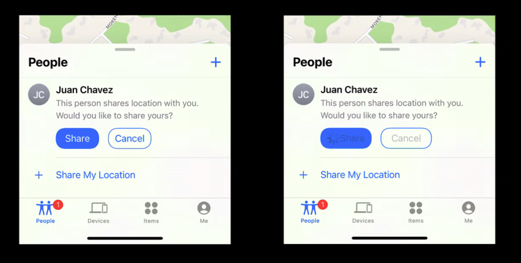

- [[Collection]]
	- ```
	  NSArray = 불변형
	  NSMutableArray = 가변형
	  ```
-
## [[Human Interface Guideline]] #Design
collapsed:: true
	- ### [[Button]]
		- Toggle
			- 기본 규칙
			- 두가지의 반대되는 옵션을 제시할 때 사용 할 것
			- 토글이 영향을 주는 설정값, 뷰, 컨텐츠 등을 명확히 할 것
			- 토글의 상태를 알 수 있도록 상태의 차이를 명확히 표현 할 것.
			- 이미지
				- 
				-
		- Pop-up buttons
			- 동일한 속성을 사용하여 리스트 목록을 보고 사용 할 수 있도록 사용
			- 드랍 다운 리스트 같이 변경하는 사항으로 swift에서는 Picker
			- 이미지
				- 
		- Segmented controls
			- 비슷한 속성을 가진 컨트롤 들의 분류를 관리 할 때 사용 (최대 3-4개정도)
			- (심볼을 사용하면 심볼만 사용하고, 문자를 사용시에는 문자만 사용)
			- 레이블 작성할 때, 명사화 시켜서 작성하도록
			- Picker style .segment
			- 이미지
				- 
		- minimum hit target size
			- 44 x 44 point
		- setting extra space (margin)
			- 이미지
				- 
		- Style
			- 이미지
				- 
					-
			- 사이즈 설정과 스타일 설정 중에는 스타일 설정이 강조에 더 중요하다.
		- Clear Contents
			- 이미지
				- {:height 322, :width 565}
		- Feedback for delayed action
			- 비동기 처리에 대한 피드백을 사용자에게 버튼으로 줄 수 있다.
			  + 비동기 처리가 있을 때 피드백을 주도록 작성해라
			- 이미지
				- 
		- Major roles of buttons
			- 노멀 - 특수한 목적이 없는 버튼
			- 주요함 - 대부분 사람들이 화면에서 선택해야만 하는 역할
			- 취소 - 기존 액션을 취소하는 역할
			- 파괴 - 데이터를 파괴(삭제) 하는 역할
			-
			- 사용자가 선택할 가능성이 가장 높은 버튼에 주요 역할을 할당 할것
			- 데이터를 파괴하는 기능에 주 기능을 배치하지 말 것
	- ### [[Boxes]]
		- 테두리 또는 배경색을 이용하여 다른 인터페이스와 구분
		- 제목도 상자 내에 포함시킬 수 있음
		- Basic Rules
			- 상자를 뷰 크기보다 작게 유지할 것
			- 패딩과 콘텐츠 정렬을 사용해 박스 내 콘텐츠의 내용(정보)간 그룹을 구성하는 것을 고려 할 것
			- 박스를 통해 인접성의 원리를 구획을 지어 줄 수 있고 레이아웃 사용 가능
		- 이미지
		  collapsed:: true
			- 
	- ### [[Lists and Tables]]
		- 그룹 또는 계층으로 된 데이터를 나타냄
		- 옵션의 선택, 추가, 삭제와 같은 상호작용 활성화 가능
		- Basic Rules
			- 텍스트를 표시해주는 것을 권장 ( 행 기반 형식 한정 )
			- 이미지를 나열 해야 할 경우엔 Collections 를 사용 할 것
			- 리스트 아이템을 선택 했을 때 피드백을 줄 것 (하이라이트, 체크마크 등)
		- 이미지
		  collapsed:: true
			- 
	- ### [[Collections]]
		- 이미지 기반 콘텐츠를 표시할 때 쓰임
		- Basic Rules
			- 가능한 그리드 레이아웃을 권장
			- 요소를 선택하기 좋게 만들 것 
			  (이미지 크기나 주변 패딩을 확보해 탭하기 좋게)
			- 텍스트만을 보여주어야 한다면 리스트/테이블을 사용할 것
			- 필요할 경우에는 커스텀 인터렉션을 연결해 줄 것
			- 추가 및 삭제될 경우에는 해당하는 피드백을 계속 제공할 것
		- 이미지
		  collapsed:: true
			- 
	- ### [[Search Fields]]
		- 검색, 지우기 버튼, 플레이스홀더 등이 포함된 텍스트 입력 프레임
		- 검색 , 필터 등의 키워드를 입력 할때 사용
		- Basic Rules
			- 검색어를 안내하는 힌트(플레이스 홀더)를 제공
			- 검색 필드 근처에 유용한 기능(바로가기, 기타 콘텐츠)을 제공하는 것도 효과적임
			  (UISearchSuggestion) -> 유사검색어
			- 검색을 시작할 타이밍을 고려 할 것 (검색 버튼을 탭했을때, 혹은 매번 (매글자) 검색어를 입력 받을 때)
			- 내용 지우기 버튼을 포함하는 것을 권장
			- 검색 결과를 표시하기 전 개인정보 보호를 위한 Scope Bar를 제공하는 것을 고려할 수 있음
			- 스코프 바를 표시하는 것도 좋지만 원칙적으로는 검색 결과를 개선하는 것이 더 중요함
			- 이미지
			  collapsed:: true
				- 
		- 이미지
		  collapsed:: true
			- 
	- ### [[Gesture]]
		- 다른 모든 앱들과 공통의 제스처를 사용 할 것
		- 반드시 필요한 경우에만 커스텀 제스처를 만들어 사용할 것
			- 기억하기 좋고 동작이 쉬운가
			- 이미 알고 있는 다른 제스처와 유사하지 않은가
			- 커스텀 제스처만으로 해당 액션을 수행하지 않도록 할 것
		- 제스처가 적절한 콘텐츠에 사용되는지 고려 할 것
		- 시스템에서 사용하는 모서리 제스처를 방해하지 말 것
		- Standard Gesture
			- 
- TODO #TODO 노션에 작성한 필기 LogSeq로 가져오기
  :LOGBOOK:
  CLOCK: [2023-07-06 Thu 21:01:41]--[2023-07-06 Thu 21:01:41] =>  00:00:00
  CLOCK: [2023-07-06 Thu 21:01:43]--[2023-07-13 Thu 14:10:38] =>  161:08:55
  :END:
-