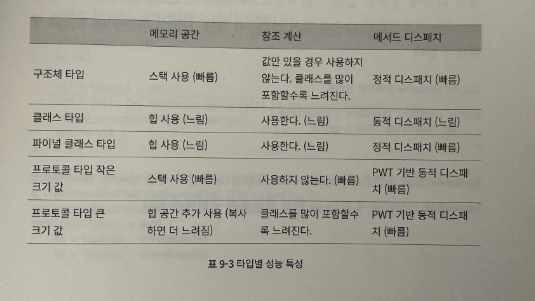

- 자료
  collapsed:: true
	- _김찬형_1689060258071_0.pdf)
	- _김찬형_1689060465317_0.pdf)
	- 
- 메모리 타입별 성능 특성
  collapsed:: true
	- 
	-
- # #swift
	- ## [[캡처값]]
		- #+BEGIN_QUOTE
		  클로저는 정의된 컨텍스트에서 상수와 변수를 캡처 할 수 있다. 
		  = 중첩 함수나 클로저 사용시에 상수와 변수가 해당하는 값을 물고 있을 경우에 메모리 상에서 해제 되지 않고 들고 있다고 이해하면 쉽다.
		  #+END_QUOTE
		- 예시)
			- ((64ad0e3e-9884-487c-bd9a-0ec553554c0b))
			- 위의 경우 makeIncrementer 는 함수를 반환 하고자 하지만 내부의 runningTotal 을 참조 하고 있기 때문에 해당 하는 변수를 캡처 하고 있다고 할 수 있다.
			- 추가적으로) 함수, 메서드, 클로저는 전부 참조 형식인 것을 잊으면 안된다.
		- ## #Closure 는 참조타입
			- #+BEGIN_QUOTE
			  클로저는 참조 타입으로써 하단과 같은 예시일 경우 둘 다 주소값을 참고하기 때문에
			  둘 다 증가하고 같은 러닝 합계를 반환
			  #+END_QUOTE
				- 예시)
				- ((64ad0efc-bccb-4985-933f-51e2ad025fff))
				- 값이 10씩 계속해서 증가하는 사항을 알수 있다.
				- 물론 동일한 Increment를 새롭게 생성해서 새로운 인스턴스의 경우에는 달라진다.
		- ## 이스케이프 클로저 (Escape Closure)
			- #+BEGIN_QUOTE
			  클로저가 함수에 인자로 전달됐지만 함수가 종료된 뒤 실행되는 것 (콜백 함수)
			  인자로 전달된 클로저가 함수의 밖의 변수에 저장되거나 함수가 종료된 뒤 실행되는 클로저를 @escaping 클로저 라고 합니다.
			  #+END_QUOTE
			- #+BEGIN_QUOTE
			  self를 참조하는 경우에는 self가 클래스의 인스턴스를 참조하는 경우에 **강한 참조 사이클**이 생기기 쉽습니다. 주의해서 설계하셔야 한다..
			  #+END_QUOTE
			-
- 옵셔널 체이닝
	- 옵셔널 체닝에서 ?의 의미는
	   ? 바로 앞에 있는 존재가 nil인지 따져서
	   nil이면 거기서 끝! 다음줄 코드 실행으로 바로 넘어감
	   nil이 아니면 ? 이후의 내용에 접근, 정상 실행...
-