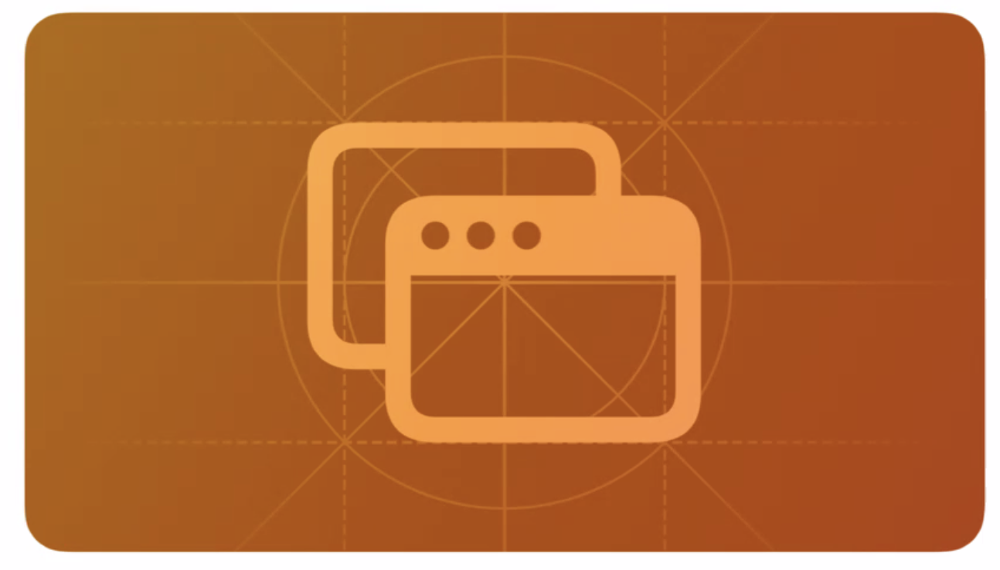
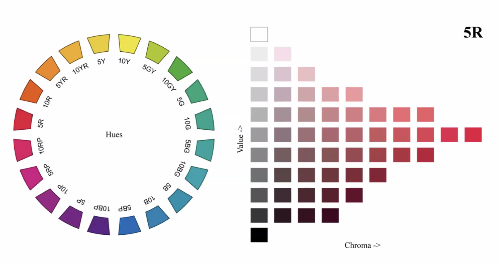
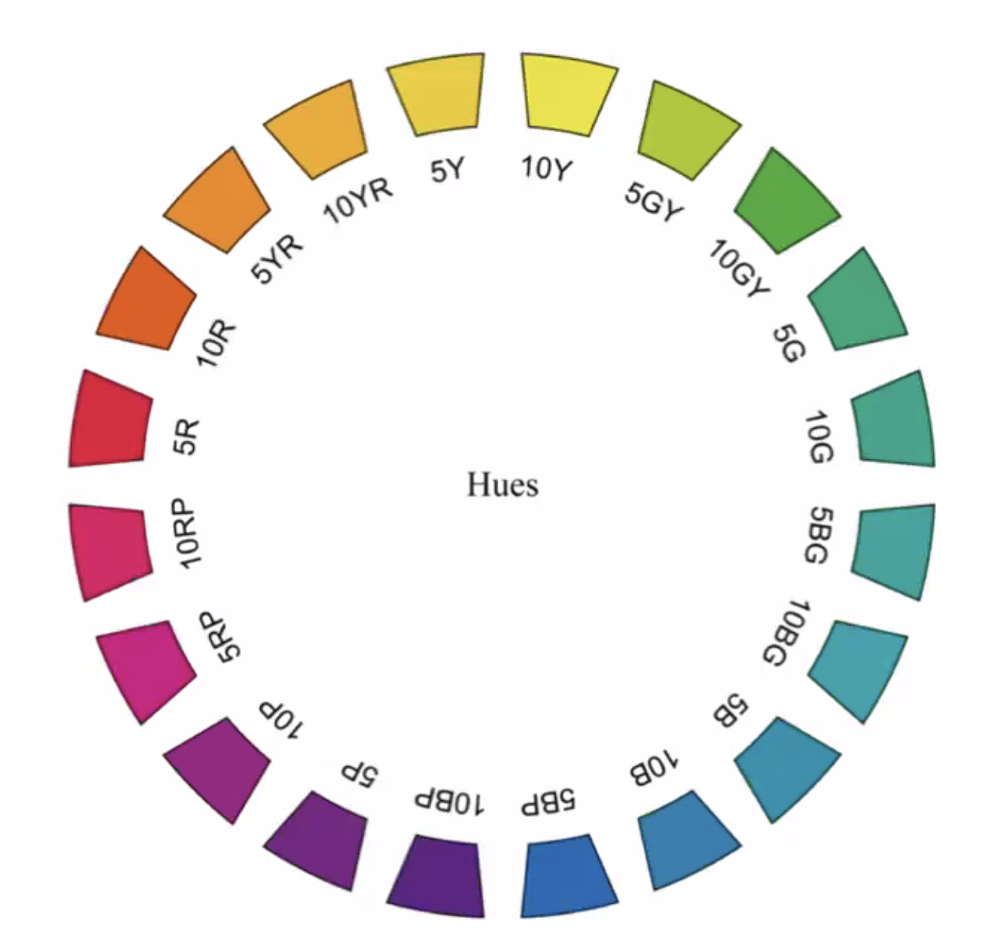
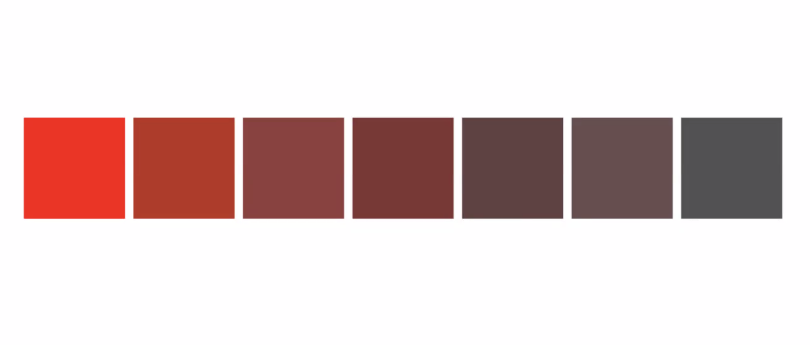
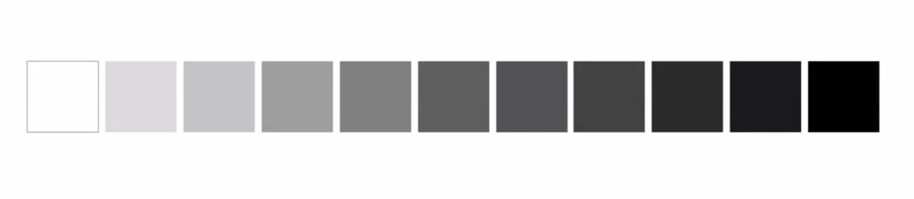
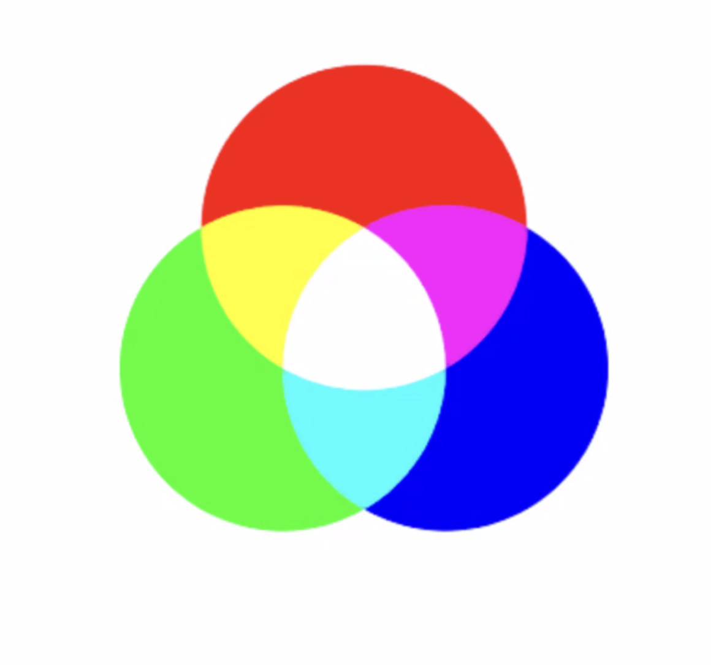
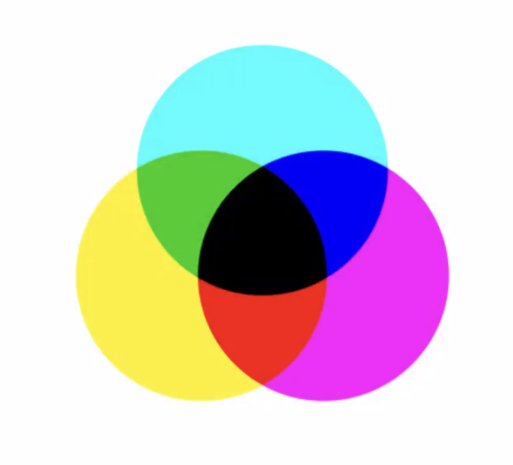
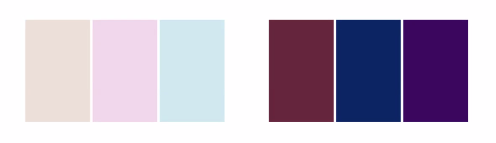
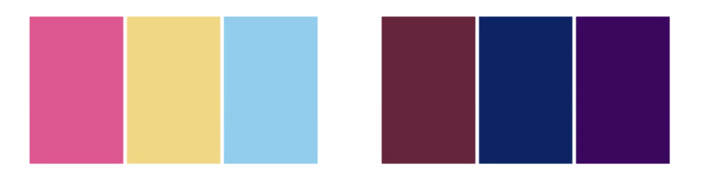
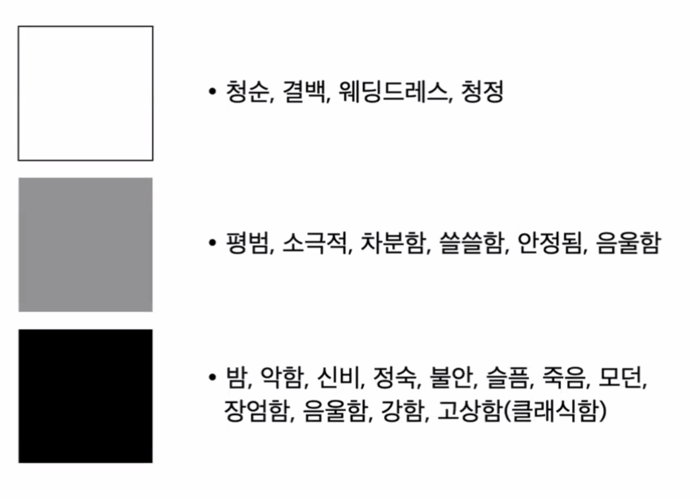

# [[Human Interface Guideline]] #Design
collapsed:: true
	- ## [[Modality]]
		- 내가 아는 그 Modal 폼을 뜻함( SwiftUI에서는 Sheet )
		- 중요 정보를 수신하고 필요한 경우 즉시 조치를 취할 수 있음
		- 최근 작업을 확인하거나 수정하기 용이함
		- 사용 맥락에서 벗어나지 않고 특정 목적에 집중한 작업에 특화
		- 이미지
		  collapsed:: true
			- 
			-
		- Basic Rules
			- 모달 사용의 명확한 이점이 있을 때만 사용할 것
			- 모달 작업은 단일 목적을 지향 할 것
			- 모달 내부에서 행하는 작업이 또다른 독립된 앱처럼 보이지 않도록 할 것
			- 표시할 내용이 복잡한 작업은 전체 화면 모달을 사용 할 것
			- 모달 보기를 해제하는 명확한 방법을 항상 표기해 둘 것
			- 필요할 경우 모달을 닫기 전 사용자의 확인을 받아 데이터 유실을 피할 것ㅁ
			- 모달 자체의 레이블링을 명확히 하여 사용 맥략을 구분해 줄 것
	- ## [[Data Input]]
		- Basic Rules
			- 시스템에서 정보를 얻을 수 있다면 그렇게 할 것
			- 필요한 데이터를 명확히 제시 할 것
			- 민감 정보에 대해선 보안 텍스트 필드(SecureField)를 사용 할 것
			- 암호 필드는 미리 채워두지 말 것
			- 필드 값은 동적으로 검증할 것
			- 꼭 필요한 경우가 아니라면 텍스트 직접 입력 방법 외의 수단을 택할 것
			- 가능한 Drag& Drop이나 붙여넣기 등으로도 데이터를 제공하도록 할 것
			  (Accessibility)
	- ## [[Charting]]
		- 데이터를 시각적으로 표시하고 비교하기가 쉽기 때문에 한 눈에 파악하기에 용이하다.
		- 이미지
		  collapsed:: true
			- 
			-
		- Basic Rules
			- 데이터 세트를 통해 중요한 정보를 전달 할 때에만 차트를 사용할 것
			- 차트를 가급적 단순하게 유지할 것
			- 차트의 접근성 향상을 고려할 것
				- 축 데이터를 항상 제공하여 명확성과 포괄성을 유지하시오
				- 주관적인 용어를 사용하지 마시오
				- 데이터 축의 단위 등을 모호한 형식으로 표현하지 마시오
				- 차트의 세부 정보에 대해 설명하는 데 집중하시오. (예: 색상으로 데이터 구분. 색맹,색약 또한 고려)
				- 앱 전체에서 데이터 설명 순서에 대해 일관성을 유지하시오. (예: X축을 항상 우선 언급한다 )
	- ## [[Typography]]
		- d
			- d
			-
	- ## [[Playing Audio]]
		- Basic Rules
			- 무음 모드에서는 미디어 재생이나 알람과 같이 사람들이 의도한 오디오만 재생해야 함
			- 헤드폰을 뽑을 때(혹은 무선 연결이 해제될 때) 사운드 재생이 일시 정지되어야 함
			- 볼륨 레벨을 가급적 별도로 조절하고 시스템 볼륨은 소프트웨어적으로 조절하지 말 것
			- 오디오 재생 장치 지정을 허용할 것 (블루투스 스피커, 에어팟 등)
			- 시스템에서 제공하는 볼륨 조절 클래스(MPVolumeControl 등)을 사용 할 것
			- 시스템에서 지원하지 않는 기능을 제공해야 할 때만 커스텀 오디오 플레이어 컨트롤을 생성 할 것
			- 앱이 오디오 재생을 마칠 경우 다른 앱에 알려줄 것
	- ## [[Motion]]
		- Basic Rules
			- 사용자와 모션을 사용하여 의사소통 할 것
			- 사용자가 흥미를 잃지 않도록 하되 목적을 가지고 필요한 모션만을 사용할 것
			- 모션이 정보를 전달하는 유일한 방법이 되지 않도록 모션은 언제나 선택 사항으로 고려 할 것
			- 현실적이고 사실성 있는 모션을 사용할 것 (국룰)
			- 빠르고 정확한 애니메이션을 사용 할 것
			- 자주 발생하는 상호 작용에는 애니메이션을 추가하지 말 것
	- ## [[Colors]]
		- Basic Rules
			- 앱이 게임이 아닐 경우에는 색상 팔레트를 절제하여 사용할 것
			- 서로 다른 맥락의 컨텐츠에 동일한 색상을 사용하지 말 것
			- 다크 모드와 일반 모드 양쪽에서 앱의 색상이 제대로 표시되는지 확인 할 것
			- 다양한 조명 조건에서 앱의 색상 팔레트를 테스트할 것
			- 디스플레이가 다른 기기에서 앱을 테스트 할 것 (TrueTone 디스플레이 대응을 위하여 )
			- 사용자가 커스텀 색상을 사용하도록 허용할 경우 시스템이 제공하는 컨트롤 사용을 우선 할 것
- # [[Colorology Basics]] #색채학
  collapsed:: true
	- ## Hue / Chroma / Value
		- 이미지
		  collapsed:: true
			- 
			-
		- Hue : 색상
			- 물체나 표면에 나타나는 것
			- 빨강,노랑,초록,파랑 등 다른 색과 구분되는 색
			- 이미지
			  collapsed:: true
				- {:height 304, :width 301}
		- Chroma : 채도
			- 흰색 또는 회색에서 출발하는 색감각의 정도
			- 색의 강도를 말함 (쨍하다..)
			- 이미지
				- {:height 201, :width 458}
		- Value : 명도
			- 색상이 제거된 상태에서 밝기의 정도
			- 이미지
				- {:height 104, :width 550}
		- Chroma / Combination
	- ## Mixing Color
		- ### RGB 빛의 삼원색
			- 이미지
			  collapsed:: true
				- {:height 296, :width 275}
		- ### CMYK 색의 삼원색
		  collapsed:: true
			- 이미지
				- {:height 350, :width 264}
- # [[색채심리학]]
  collapsed:: true
	- ## Color and Temperature
	  collapsed:: true
		- 빨간 계통은 따뜻한 느낌, 파란계통은 차가운 느낌을 줌
		- 안락함, 불쾌감, 긴장감 등을 직접 표현 가능
		- 색채 계획에서 최우선시 된다.
		- {:height 169, :width 543}
	- ## Color and Weight
	  collapsed:: true
		- 명도가 높거나 밝은 색은 가벼워 보임
		- 명도가 낮거나 어두운 색은 무거워 보임
		- {:height 173, :width 550}
	- ## Color and Mass
	  collapsed:: true
		- 같은 크기라도 밝게 칠해지면 크게 보임
		- 채도가 높을수록 크게 보임
		- {:height 160, :width 552}
	- ## Color and Distance
	  collapsed:: true
		- 채도가 높으면 가까워 보임
		- 채도가 낮으면 멀어 보임
		- {:height 165, :width 545}
	- ## Color and Image
	  collapsed:: true
		- {:height 378, :width 532}
- # [[Objective-C]]
  collapsed:: true
	- ## 메모리 관리
- # [[Objective-C to Swift]]
-
-
-
- DONE Quest
  collapsed:: true
	- {:height 310, :width 396}
- DONE  Obj-C 메모리 관리 정리
  :LOGBOOK:
  CLOCK: [2023-07-13 Thu 14:11:25]--[2023-08-21 Mon 07:51:17] =>  929:39:52
  :END: