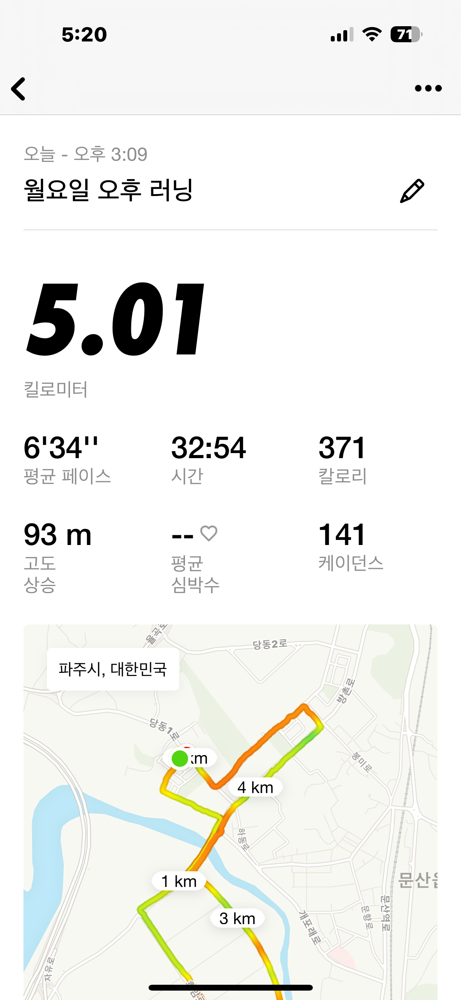

- [[독서]]
	- 날짜:: Oct 30th, 2023
	- 책_제목:: 도둑맞은 집중력
	- 책_분야:: 인문, 심리학
	- 읽은_페이지:: 7챕터
	- 오늘의-한구절:: 집중력을 SNS로부터 많이 빼앗긴다. SNS는 스크린 타임으로 돈을 버는 구조를 가진다. 따라서 이들에게 집중과 정신을 빼앗기는 행위를 해당 기업들은 자주 하게된다. 실제로 사람끼리 만나는 현상을 늘리는 대신 모바일을 사용하는 시간을 늘림으로써 광고 비용을 통해 돈을 버는 구조를 가지게 된다. 이것이 몰입을 깨도록 만드는 주된 원인이 된다 따라서 숏츠, 릴스를 벗어날 필요가 있다.
- [[Clean Architecture]]
	- 날짜:: Oct 30th, 2023
	- 책_제목:: 클린 아키텍쳐
	- 책_분야:: 개발, 아키텍쳐
	- 읽은_페이지:: 1챕터, 1-2장
	- 요약:: 개발자는 한번에 잘 짜는것이 중요하다. 기능이 돌아가게 하는 것이 먼저가 아닌 구상을 잘 하여서 적용되게 짜는 것이 무엇보다 중요하다. 그래야 어떠한 사항이 늘어나거나 수정사항이 일어날때 다음 회차 개발이 효율적으로 일어날 수밖에 없기 때문에 우리는 아키텍처를 고민하고 이에 대해서 깊게 공부할 필요가 있다. 단순히 문제를 해결 하는 수준에서 벗어나서 진정한 개발자라면 저수준의 설계, 기획 단계에서 고수준의 아키텍쳐의 적용을 고민해 볼 필요가 있다.
-
- [[운동]]
	- 활동:: 런닝
	- 시간:: 15:09 - 16:05
	- {:height 529, :width 237}