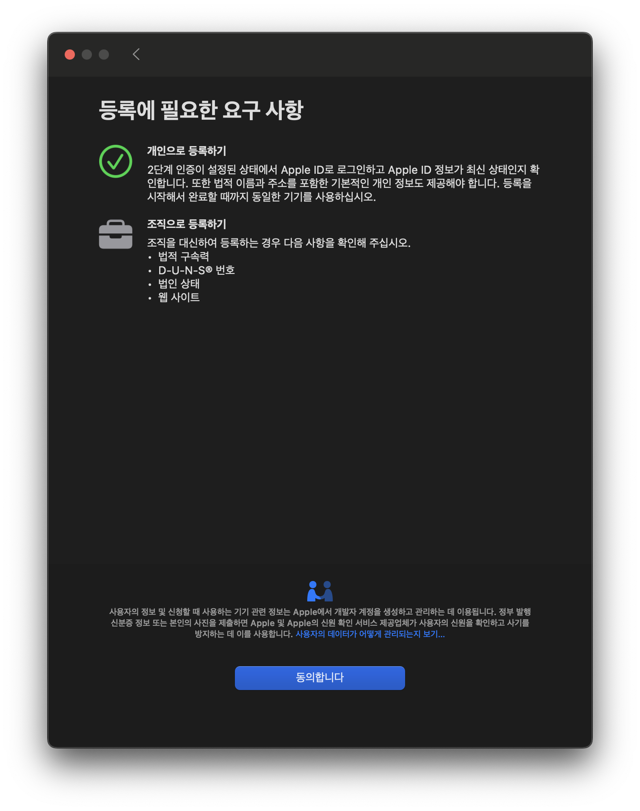

- 애플 개발자 계정 등록
  collapsed:: true
	- 결제 수단 등록 및 점검
	  logseq.order-list-type:: number
	- Apple Developer App -> 계정 -> Apple Developer Program (지금 등록하기 누르기)
	  logseq.order-list-type:: number
		- {:height 424, :width 657}
		  logseq.order-list-type:: number
	- {:height 599, :width 548}
	  logseq.order-list-type:: number
	- 이후 주소지, 동의, 결제 단계를 거치면 개발자 계정 등록이 가능하다.
	  logseq.order-list-type:: number
	- logseq.order-list-type:: number
	- logseq.order-list-type:: number
- [[운동]]
	- 활동:: 유산소 및 컨디셔닝 운동
	- 시간:: 20:30-21:30
- UIKit Poketochip 하기