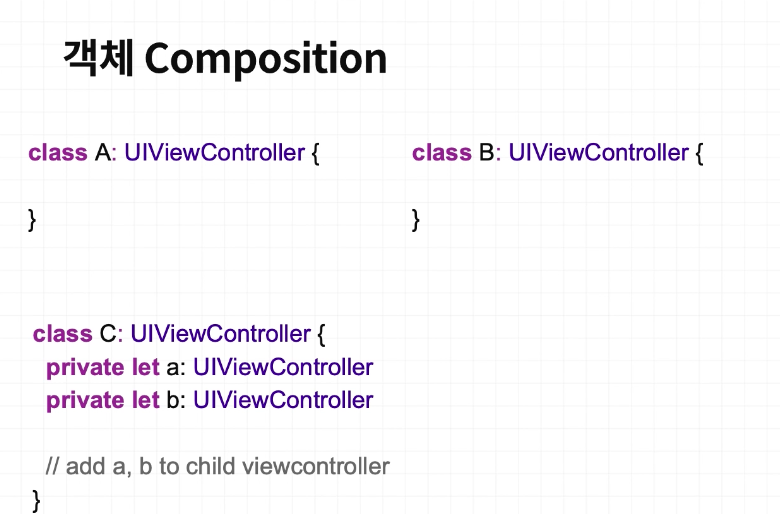
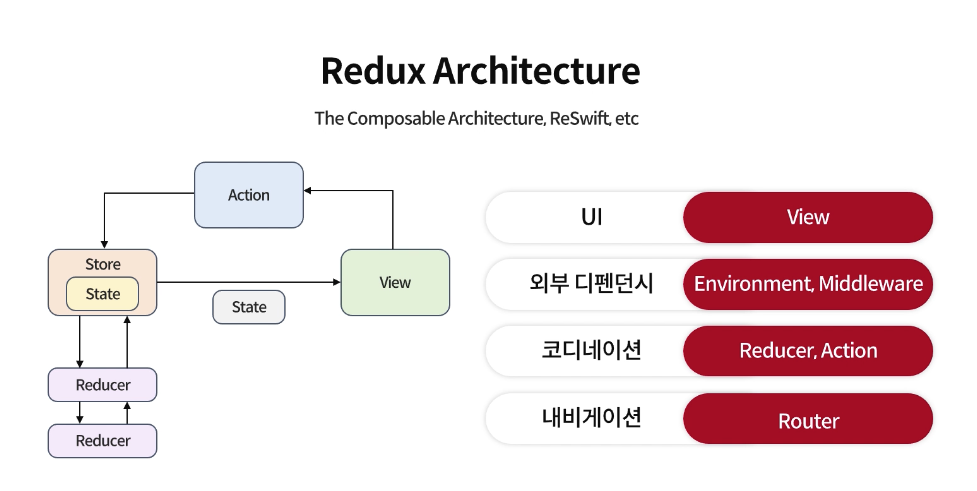

- 컴포지션으로 객체를 작은 단위로 나눔
- ViewModifier를 활용해서 뷰의 기능을 확장 + 조합 하여
- 객체 컴포지션(합성) ->
- 
- 프로그래밍 할때 하나의 객체가 너무 많은 로직과 데이터를 알고 있을 때는 불편해짐. 따라서 작게 나눌 필요가 있음.
-
- 함수형 프로그래밍 -> map. filter. reduce 를 받는 형태로 함수를 매개로 받음.
- Array / Optional / Result / Publisher 에서 map 을 사용함.
- -> 확장해서
-
- 앱에서의 비즈니스 로직
- TCA 패턴
- 
-
- RIBS의 구조
- Router / Interactor / Builder 의 구조를 가짐
- [[RIBs Architecture]]
- [[Xcode Template]]
-