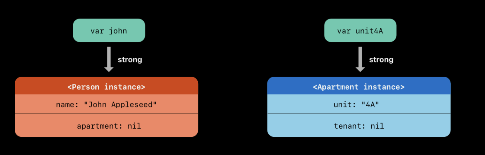
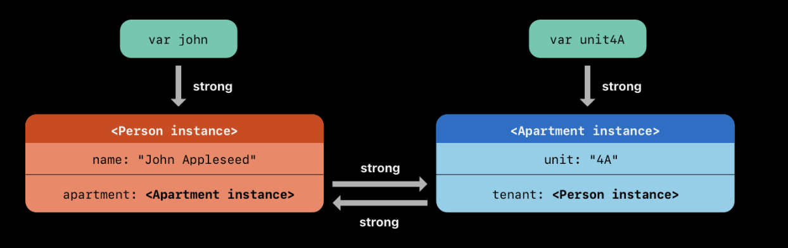
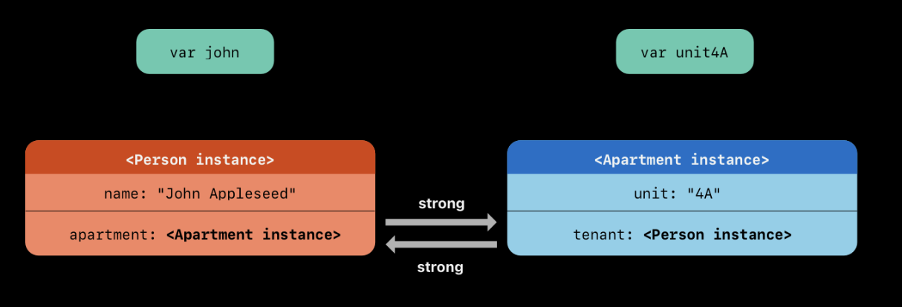
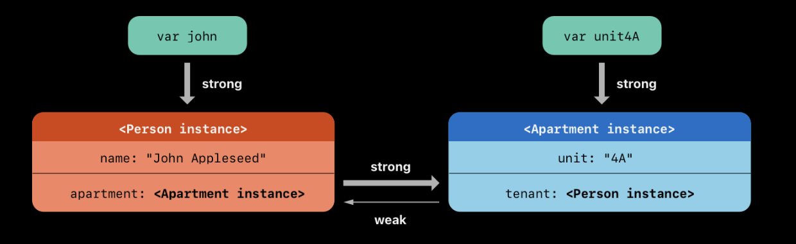
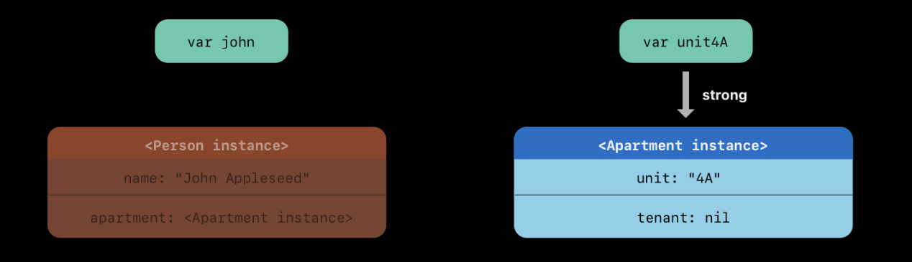
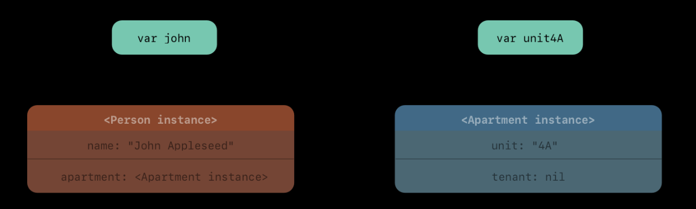
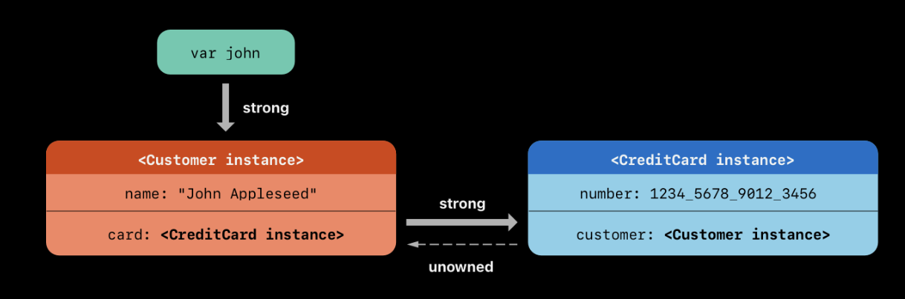
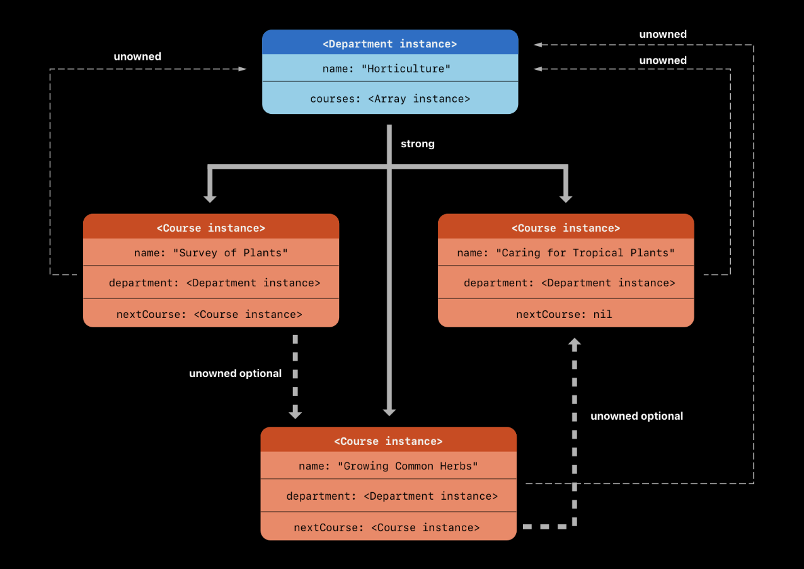
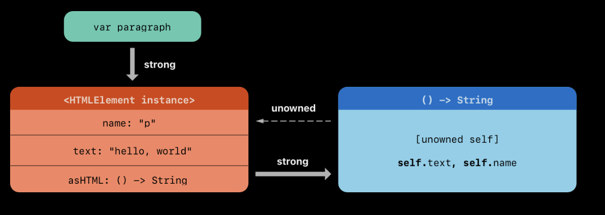

## Automatic Reference Counting
	- 스위프트의 메모리 사용 관리 / 추적 해주기 위해 ARC를 사용한다. 대부분의 경우에는 메모리 관리가 Swift에서 알아서 해준다. 따라서 메모리 관리에 대해서 크게 신경 쓸 필요가 없다.
	- "그렇지만" 몇 몇의 경우에 ARC는 메모리 관리하는 사항에 따라 정보가 필요하다.
	  하단에서는 그런 상황과 그런 경우 메모리가 관리 되는 지. 알아 둘 필요가 있다.
	- **Reference counting**는 오직 클래스의 인스턴스에만 해당된다. 구조체 및 열거형과 같은 값 타입이나 참조타입이 아닌 경우에는 저장되지 않고 참조 값에서 통과된다.
- ## How ARC Works
	- 클래스의 새 인스턴스를 생성할 때마다 ARC는 해당 인스턴스에 대한 정보를 저장하기 위해 메모리 덩어리를 할당합니다. 이 메모리에는 인스턴스 유형에 대한 정보와 해당 인스턴스와 관련된 저장된 속성의 값이 들어 있습니다.
	- 또한 인스턴스가 더 이상 필요하지 않은 경우 ARC는 해당 인스턴스에서 사용하는 메모리를 해제하여 해당 메모리를 다른 용도로 사용할 수 있도록 합니다. 이렇게 하면 클래스 인스턴스가 더 이상 필요하지 않을 때 메모리 공간을 차지하지 않습니다.
	- 그러나 ARC가 아직 사용 중인 인스턴스를 할당 해제하는 경우 더 이상 해당 인스턴스의 속성에 액세스하거나 해당 인스턴스의 메서드를 호출할 수 없습니다. 실제로 인스턴스에 액세스하려고 하면 앱이 충돌할 가능성이 높습니다.
	- 인스턴스가 여전히 필요한 동안 사라지지 않도록 하기 위해 ARC는 현재 각 클래스 인스턴스를 참조하는 속성, 상수 및 변수 수를 추적합니다. ARC는 해당 인스턴스에 대한 활성 참조가 하나 이상 존재하는 한 인스턴스 할당을 취소하지 않습니다.
	- 이를 가능하게 하려면 클래스 인스턴스를 속성, 상수 또는 변수에 할당할 때마다 해당 속성, 상수 또는 변수가 인스턴스에 대한 *강력한 참조를* 만듭니다. 이 참조는 해당 인스턴스를 확고하게 유지하고 강한 참조가 남아 있는 동안 할당 취소를 허용하지 않기 때문에 "강력한" 참조라고 합니다.
- ## ARC in Action (예시)
	- ```swift
	  class Person {
	      let name: String
	      init(name: String) {
	          self.name = name
	          print("\(name) is being initialized")
	      }
	      deinit {
	          print("\(name) is being deinitialized")
	      }
	  }
	  ```
	- ARC가 일어나는 방식에 대한 설명인데. Person 클래스인데 저장된 프로퍼티를 초기화하면 프린되는 단순한 클래스이다.
	- 클래스 `Person`에는 인스턴스의 `name`속성을 설정하고 초기화가 진행 중임을 나타내는 메시지를 인쇄하는 초기화 프로그램이 있습니다. 클래스 `Person`에는 클래스의 인스턴스 할당이 취소될 때 메시지를 인쇄하는 초기화 해제 프로그램도 있습니다.
	- 다음 코드 뭉치는 `Person? ` 타입의 새 인스턴스에 대한 여러 참조를 설정하기 위한 변수 3개를 선언하였다. 왜냐하면 이 변수들은 옵셔널 타입으로 자동적으로 nil 값으로 초기화되었지만 Person 인스턴스에 참조되지 않았다.
	- ```swift
	  var reference1: Person?
	  var reference2: Person?
	  var reference3: Person?
	  //아무일도 일어나지 않음 선언시에 nil로 사용되었으나 이것이 Person의 참조가 아니기 때문
	  ```
	- 그리고 나서 새 객체 중 하나에 Person 인스턴스로 선언 해보자
	- ```swift
	  reference1 = Person(name: "John Appleseed")
	  // Prints "John Appleseed is being initialized"
	  ```
	- 이후에 이 값을 복사해보자
	- ```swift
	  reference2 = reference1
	  reference3 = reference1
	  // 아무일도 일어나지 않는다. 왜? 이미 선언은 한 개만 사용됨^-^
	  ```
	- 이에 따라 강력한 참조가 Person 인스턴스 하나에 사용 되었다.
	- 이를 하나 하나 소멸 시켜 보려 한다. 메모리에서 해제 시키는 건 참조 값을 nil로 만들면 된다.
	- ```swift
	  reference1 = nil
	  reference2 = nil
	  // 역시 아무일 일어나지 않는다.
	  
	  이후에
	  reference3 = nil
	  // Prints "John Appleseed is being deinitialized"
	  ```
	- `Person`ARC는 세 번째이자 마지막 강력한 참조가 깨질 때까지 인스턴스 할당을 해제하지 않습니다 . 이 시점에서는 `Person`인스턴스를 더 이상 사용하지 않는다는 것이 분명해집니다.
- ## Strong Reference Cycles Between Class Instances
	- 위의 예에서 ARC는 생성된 새 인스턴스에 대한 참조 수를 추적 하고 더 이상 필요하지 않은 인스턴스의 `Person` 할당을 해제 할 수 있습니다.
	- 그러나 클래스의 인스턴스가 강력한 참조가 사라지지 않게 하는 코드를 작성하는 것은 가능합니다. 이는 두 클래스 인스턴스가 서로에 대한 강력한 참조를 보유하여 각 인스턴스가 다른 인스턴스를 활성 상태로 유지하는 경우 발생할 수 있습니다. 이것을 *강한 순환 참조* 이라고 합니다 .
	- 아래와 같이 선언 시 강한 순환 참조를 발생 시킬 수 있습니다.
	- ```swift
	  class Person {
	      let name: String
	      init(name: String) { self.name = name }
	      var apartment: Apartment?
	      deinit { print("\(name) is being deinitialized") }
	  }
	  
	  class Apartment {
	      let unit: String
	      init(unit: String) { self.unit = unit }
	      var tenant: Person?
	      deinit { print("Apartment \(unit) is being deinitialized") }
	  }
	  ```
	- ```swift
	  john = Person(name: "John Appleseed")
	  unit4A = Apartment(unit: "4A")
	  ```
	- 
	- ```swift
	  john!.apartment = unit4A
	  unit4A!.tenant = john
	  ```
	- 
	- 불행하게도 서로 두 인스턴스가 강한 순환 참조를 둘의 사이에 만들어 버렸다. Person 인스턴스는 Apartment 인스턴스에 강한 참조가 생겼고, Apartment 인스턴스는 Person 인스턴스에 강한 참조가 생겼다. 그러므로 john / unit4A 변수의 강한 참조를 깨려할 때, 참조 카운트 값이 0 으로 떨어지지 않아 ARC에 의해 메모리 할당이 해제되지 않는다.
	- ```swift
	  john = nil
	  unit4A = nil
	  ```
	- 하여도 인스턴스 이름에 참조된 인스턴스가 분리 될 뿐, 서로서로 인스턴스가 남아있어 메모리 상에서 해제 되지 않는다. 이 강한 순환 참조는 Person / Apartment 인스턴스가 메모리 할당 해제 되는 것을 막고, 그것은 우리 앱에 메모리 누수를 야기 시킨다.
	- 
- ## Resolving Strong Reference Cycles Between Class Instances
	- Swift는 클래스 유형의 속성으로 작업할 때 강력한 참조 순환을 해결하는 두 가지 방법, 즉 약한 참조와 소유되지 않은 참조를 제공합니다.
	- 약하고 소유되지 않은 참조를 사용하면 참조 순환의 한 인스턴스가 이를 강력하게 유지 *하지 않고도* 다른 인스턴스를 참조할 수 있습니다 . 그러면 인스턴스는 강력한 참조 순환을 생성하지 않고도 서로를 참조할 수 있습니다.
	- 다른 인스턴스의 수명이 더 짧은 경우, 즉 다른 인스턴스를 먼저 할당 취소할 수 있는 경우 약한 참조를 사용합니다. 위의 예 에서 `Apartment`아파트는 수명 중 특정 시점에 세입자가 없을 수 있는 것이 적절하므로 이 경우 약한 참조는 참조 순환을 깨는 적절한 방법입니다. 대조적으로, 다른 인스턴스의 수명이 동일하거나 더 길면 소유되지 않은 참조를 사용하십시오.
	- ### Weak References
		- 약한 *참조* 는 참조하는 인스턴스를 강력하게 유지하지 않는 참조이므로 ARC가 참조된 인스턴스를 삭제하는 것을 막지 않습니다. 이 동작은 참조가 강력한 참조 순환의 일부가 되는 것을 방지합니다. `weak`속성이나 변수 선언 앞에 키워드를 배치하여 약한 참조를 나타냅니다 .
		- 약한 참조는 참조하는 인스턴스를 강력하게 유지하지 않기 때문에 약한 참조가 계속 참조하는 동안 해당 인스턴스의 할당이 해제될 수 있습니다. 따라서 ARC는 `nil`참조하는 인스턴스가 할당 해제되는 시점 에 대한 약한 참조를 자동으로 설정합니다 . 그리고 약한 참조는 런타임에 해당 값이 변경되도록 허용해야 하기 때문에 `nil`항상 선택적 유형의 상수가 아닌 변수로 선언됩니다.
		- 다른 선택적 값과 마찬가지로 약한 참조에 값이 있는지 확인할 수 있으며 더 이상 존재하지 않는 잘못된 인스턴스에 대한 참조로 끝나지 않습니다.
		- 
		- 
		- 
	- ### Unowned References
		- 약한 참조 (Weak Reference)와 차이점 이자, 중요한 점
		- 약한 참조와 마찬가지로 *소유되지 않은 참조는* 참조하는 인스턴스를 강력하게 유지하지 않습니다. 그러나 약한 참조와 달리 소유되지 않은 참조는 다른 인스턴스의 수명이 동일하거나 더 길 때 사용됩니다. `unowned`속성이나 변수 선언 앞에 키워드를 배치하여 소유되지 않은 참조를 나타냅니다 .
		- 약한 참조와 달리 소유되지 않은 참조는 항상 값을 가질 것으로 예상됩니다. 결과적으로 값을 소유되지 않음으로 표시한다고 해서 선택 사항이 되는 것은 아니며 ARC는 소유되지 않은 참조의 값을 `nil`로 설정하지 않습니다.
		- #+BEGIN_QUOTE
		  참조가 항상 할당 취소되지 않은 인스턴스를 참조한다고 확신하는 경우에만 소유되지 않은 참조를 사용하십시오 .
		  해당 인스턴스가 할당 취소된 후 소유되지 않은 참조의 값에 액세스하려고 하면 런타임 오류가 발생합니다.
		  #+END_QUOTE
		- ```swift
		  class Customer {
		      let name: String
		      var card: CreditCard?
		      init(name: String) {
		          self.name = name
		      }
		      deinit { print("\(name) is being deinitialized") }
		  }
		  
		  
		  class CreditCard {
		      let number: UInt64
		      unowned let customer: Customer
		      init(number: UInt64, customer: Customer) {
		          self.number = number
		          self.customer = customer
		      }
		      deinit { print("Card #\(number) is being deinitialized") }
		  }
		  ```
		- ```swift
		  var john: Customer?
		  
		  ->
		  
		  john = Customer(name: "John Appleseed")
		  john!.card = CreditCard(number: 1234_5678_9012_3456, customer: john!)
		  ```
		- 
		- 여기서 john = nil 로 처리가 되는 순간
		- ```swift
		  john = nil
		  // Prints "John Appleseed is being deinitialized"
		  // Prints "Card #1234567890123456 is being deinitialized"
		  ```
		- *위의 예는 안전한* 미소유 참조를 사용하는 방법을 보여줍니다 . Swift는 또한 성능상의 이유로 런타임 안전성 검사를 비활성화해야 하는 경우를 위해 *안전하지 않은* 소유되지 않은 참조를 제공합니다. 안전하지 않은 모든 작업과 마찬가지로 해당 코드의 안전 여부를 확인할 책임은 사용자에게 있습니다.
		- `unowned(unsafe)`를 작성하여 안전하지 않은 미소유 참조를 나타냅니다 . 참조하는 인스턴스가 할당 해제된 후 안전하지 않은 소유되지 않은 참조에 액세스하려고 하면 프로그램은 해당 인스턴스가 있던 메모리 위치에 액세스하려고 시도합니다. 이는 안전하지 않은 작업입니다.
	- ### Unowned Optional References
		- 클래스에 대한 선택적 참조를 소유되지 않음으로 표시할 수 있습니다. ARC 소유권 모델의 관점에서 볼 때, 소유되지 않은 선택적 참조와 약한 참조는 모두 동일한 컨텍스트에서 사용될 수 있습니다. 차이점은 소유되지 않은 선택적 참조를 사용할 때 항상 유효한 개체를 참조하거나 `nil`로 설정되어 있는지 확인해야 한다는 것입니다.
		- ```swift
		  class Department {
		      var name: String
		      var courses: [Course]
		      init(name: String) {
		          self.name = name
		          self.courses = []
		      }
		  }
		  
		  class Course {
		      var name: String
		      unowned var department: Department
		      unowned var nextCourse: Course?
		      init(name: String, in department: Department) {
		          self.name = name
		          self.department = department
		          self.nextCourse = nil
		      }
		  }
		  ```
		- 이후
		- ```swift
		  let department = Department(name: "Horticulture")
		  
		  
		  let intro = Course(name: "Survey of Plants", in: department)
		  let intermediate = Course(name: "Growing Common Herbs", in: department)
		  let advanced = Course(name: "Caring for Tropical Plants", in: department)
		  
		  
		  intro.nextCourse = intermediate
		  intermediate.nextCourse = advanced
		  department.courses = [intro, intermediate, advanced]
		  ```
		- 
		- 선택 사항이 아닌 소유되지 않은 참조와 마찬가지로 할당이 취소되지 않은 코스를 항상 참조하는지 확인해야 할 책임이 있습니다 .
		  예를 들어 이 경우 강좌를 삭제할 때 다른 강좌에 있을 수 있는 해당 강좌에 대한 참조도 모두 제거해야 합니다
	- ### Unowned References and Implicitly Unwrapped Option Properties
		-
- ## Strong Reference Cycles for Closures
- ## Resolving Strong Reference Cycles for Closures
	- ### Defining a Capture List
		- 캡처 목록의 각 항목은 `weak`또는 `unowned`키워드와 클래스 인스턴스(예: `self`)에 대한 참조 또는 일부 값(예: `delegate = self.delegate`)으로 초기화된 변수 의 쌍입니다.
		  이러한 쌍은 쉼표로 구분된 한 쌍의 대괄호 안에 작성됩니다.
		- 클로저의 매개변수 목록 앞에 캡처 목록을 배치하고 반환 유형을 입력
		- ```swift
		  lazy var someClosure = {
		          [unowned self, weak delegate = self.delegate]
		          (index: Int, stringToProcess: String) -> String in
		      // closure body goes here
		  }
		  
		  클로저가 컨텍스트에서 추론할 수 있기 때문에 매개변수 목록이나 반환 유형을 지정하지 않는 경우, 
		  캡처 목록을 클로저의 시작 부분에 배치하고 (in:) 키워드를 뒤에 배치합니다 
		  
		  lazy var someClosure = {
		          [unowned self, weak delegate = self.delegate] in
		      // closure body goes here
		  }
		  ```
	- ### Weak and Unowned References
		- 클로저와 클로저가 캡처하는 인스턴스가 항상 서로를 참조하고 항상 동시에 할당 해제될 때 클로저의 캡처를 소유되지 않은 참조로 정의하십시오.
		- 반대로, 캡처된 참조가 미래의 특정 시점에 `nil`이 될 수 있는 경우 캡처를 약한 참조로 정의하십시오.. 약한 참조는 항상 선택적 유형이며 참조하는 인스턴스가 할당 해제되면 자동으로 `nil`이 됩니다.
		- ```swift
		  class HTMLElement {
		  
		      let name: String
		      let text: String?
		  
		      lazy var asHTML: () -> String = {
		              [unowned self] in
		          if let text = self.text {
		              return "<\(self.name)>\(text)</\(self.name)>"
		          } else {
		              return "<\(self.name) />"
		          }
		      }
		  
		      init(name: String, text: String? = nil) {
		          self.name = name
		          self.text = text
		      }
		  
		      deinit {
		          print("\(name) is being deinitialized")
		      }
		  }
		  ```
		- ```swift
		  var paragraph: HTMLElement? = HTMLElement(name: "p", text: "hello, world")
		  print(paragraph!.asHTML())
		  // Prints "<p>hello, world</p>"
		  ```
		- 
		- ```swift
		  paragraph = nil
		  // Prints "p is being deinitialized"
		  ```