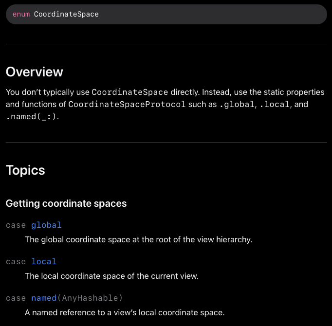

- 공식 문서엔 "뷰의 좌표에 이름을 정해서 다른 코드에서 작동하도록 하는 메서드" 라고 소개합니다.
- 즉, 뷰의 위치를 '어느 기준으로 바라볼 것인가'를 정하는 메서드입니다.
- 이미 정해진 기준이 global,local이 존재하며 원하는 뷰를 named를 통해서 이름 붙일 수 있습니다.
- {:height 358, :width 347}
	- #### 1. global
		- global은 전체 화면에서 바라보았을 때의 위치를 의미합니다.
		- -> 뷰 전체 (기기의 화면 스크린 기준의 좌표 기준으로 알려줌)
	- #### 2. local
		- 현재 직접적으로 감싸져 있는 뷰에서 바라보았을 때의 위치를 의미합니다.
		- -> GeometryReader에서의 위치
	- #### 3. named
		- 원하는 뷰에 이름을 붙이고 해당 뷰에서 바라보았을 때 위치를 의미합니다.
		- ex) .named("HStack")
-
- ```swift
  HStack {
  	Spacer()
  		GeometryReader { proxy in
  			GeometryReaderDetailView()
  				.onAppear {
  					print(proxy.frame(in: .global))
  					print(proxy.frame(in: .local))
  					print(proxy.frame(in: .named("HStack")))
  				}
              }
         }
  		.coordinateSpace(name: "HStack")
  ```
-
- GeometryProxy.frame(in : CoordinateSpace) 에서
-