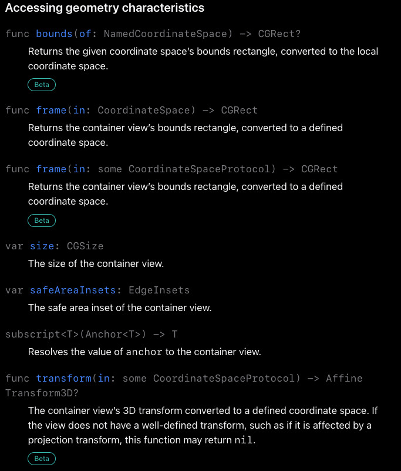

- https://developer.apple.com/documentation/swiftui/geometryproxy
- #+BEGIN_QUOTE
  컨테이너 뷰의 좌표나 크기를 접근할 수 있는 것
  #+END_QUOTE
- 즉 GeometryReader 하위에서 컨텐츠에 대한 구성을 할때 주는 값이 Geometry 라는 값을 클로저에 인자로 던져 주는 형태로 제공함
- 보통 frame(in:) 메서드를 이용하여 좌표값을 구하고, 
  size를 이용하여 크기를, 
  safeAreaInsets를 통해 컨테이너 뷰의 safe area의 가장 자리를 구할 수 있습니다.
- {:height 525, :width 424}
- iOS 17 -> bounds, frame, transform 추가 // VisionOS 사용을 위한 값과 비슷하다고 느껴짐 GeometryReader3D
-
- ## Size
	- ```swift
	  HStack {
	  	GeometryReader { proxy in
	  		GeometryReaderDetailView()
	  			.onAppear {
	  				print(proxy.size)
	  			}
	  		}
	  		Spacer()
	  	}
	  //알아내고 싶은 View의 GeometryReader로 감싸서 size로 출력 받을 수 있음
	  ```
	- width와 height를 알아낼 수 있습니다.
-
- ## Frame
	- 이제 크기를 알아냈으니 해당 컨테이너가 어디에 위치해 있는지 좌표를 구해보도록 하겠습니다.
	- 좌표를 구하기 위해선 proxy의 frame(in:)을 이용
	- 뷰의 좌표에 이름을 정해서 다른 코드에서 작동하도록 하는 메서드 이라고 하면 어렵다.
	- 즉, 뷰의 위치를 '어느 기준으로 바라 볼 것인가를 설정하는 메서드'
		- ### [[CoordinateSpace]]
	-
- ## SafeAreaInsets
	- GeometryProxy에선 해당 컨테이너 뷰의 safeareaInsets의 정보
	- EdgeInsets(top: 47.0, leading: 0.0, bottom: 34.0, trailing: 0.0)
	- .ignoresSafeArea(.all) -> EdgeInsets(top: 0.0, leading: 0.0, bottom: 0.0, trailing: 0.0)
-