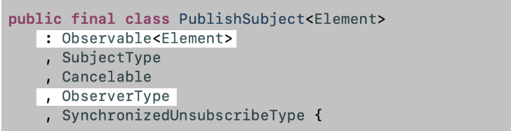

- #+BEGIN_QUOTE
  Reactive Programming in Swift = RxSwift
  #+END_QUOTE
- **반응형 프로그래밍**
  logseq.order-list-type:: number
	- 데이터의 흐름 및 변경사항을 전파하는 데 중점을 둔 프로그래밍 패러다임
	- 이 패러다임의 중요한 사항은 주변 환경/ 데이터에 변화가 생길 때 연결된 실행 모델들이 이 이벤트를 받아 동작하도록 설계하는 방식.
	- 어떤 비동기 이벤트가 있을 때, 그것을 관찰자가 존재하고, 만약 이벤트가 발생한다면, 관찰자가 해당 이벤트(데이터 흐름의 변경)에 대해 전파 받을 수 있고, 그에 따른 작업을 할 수 있다.
	- 이러한 프로그래밍을 Swift에서 쓰기 편리하게 만든게 RxSwift 이다.
		- 비동기 프로그래밍을 관찰 가능한 순차적 형태와 함수 형태의 연산자를 통해 처리하게끔 도와주는 라이브러리
- Observable
  logseq.order-list-type:: number
	- 비동기 이벤트에 대해 관찰 가능한 형태로 만드는 관찰자 -> Observable
	  logseq.order-list-type:: number
	- 관찰이 가능한 흐름으로 비동기 이벤트의 시퀀스를 생성할 수 있는 대상
	  logseq.order-list-type:: number
		- ```swift 
		  public class Observable<Element>: ObservableType {
		  }
		  ```
		- 이 처럼 제네릭 클래스로 구성이 되어 있음
	- 데이터의 변화에 대해 관찰이 가능한 형태로, RxSwift에서는 Observable 형태로 관찰자를 만들 수 있다.
	  logseq.order-list-type:: number
	- 비동기 이벤트를 관찰 가능한 형태로 만든 것이 바로 Observable이고, 실제 그 비동기 이벤트가 일어났을 때 알리기 위해 그 이벤트에 대한 항목을 시퀀스로 방출한다.
	  logseq.order-list-type:: number
- Observer
  logseq.order-list-type:: number
	- Observable에서 방출한 항목을 받는 객체가 Observer이다.
	  logseq.order-list-type:: number
	- Observer는 Observable을 구독합니다. 이를 연결 해주는 작업이 바로 "Subscribe" 라는 메서드이다.
	  logseq.order-list-type:: number
		- ```swift 
		  public func subscribe(
		      onNext: ((Element) -> Void)? = nil,
		      onError: ((Swift.Error) -> Void)? = nil,
		      onCompleted: (() -> Void)? = nil,
		      onDisposed: (() -> Void)? = nil
		  ) -> Disposable
		  ```
		- 파라미터는 4개가 있다. onNext, onError, onComplete, onDisposed
			- onNext
			  logseq.order-list-type:: number
				- Observable이 새로운 항목을 방출 할때 마다 이 클로저가 호출 됩니다.
				  logseq.order-list-type:: number
				- Observable이 방출하는 항목을 클로저의 파라미터로 전달받습니다. 
				  logseq.order-list-type:: number
			- onError
			  logseq.order-list-type:: number
				- Observable은 기대하는 데이터가 생성되지 않았거나, 다른 이유로 오류가 발생했을 때 이 오류를 Observer에게 알리기 위해 이 메서드를 호출합니다. 
				  logseq.order-list-type:: number
			- onCompleted
			  logseq.order-list-type:: number
				- Observable은 이벤트가 종료되어 더 이상 호출 되지 않을 때 Observer한테 알리기 위해 이 메서드를 호출
				  logseq.order-list-type:: number
			- onDisposed
			  logseq.order-list-type:: number
				- disposed() 메서드가 불릴 때 실행 될 클로저를 넘겨주는 것
				  logseq.order-list-type:: number
				- onError / onComplete 로 해제 되어도 실행 됨
				  logseq.order-list-type:: number
- 여기서 중요한 사항 RxSwift에는 UIKit에 대한 정보가 없어서 RxCocoa를 같이 사용해서 Reactive Programming을 해야 한다. 
  logseq.order-list-type:: number
	- ```swift 
	  UIButton.rx.tap
	  	.subscribe(onNext: {
	                  print("Observable이 항목을 방출 했다!")
	              },
	              onError: { error in
	                  print("에러가 발생 했다!")
	              },
	              onCompleted: {
	                  print("해당 이벤트가 끝났다!")
	              })
	              .disposed(by: disposedBag)
	  ```
	- 여기서 Observer을 만들어서 구독하지 않았는데 왜 되는가..?
	  logseq.order-list-type:: number
		- subscribe(onNext: { 실행 시에 해당 메서드 안에서 AnonymousObserver 를 생성해서 씀.
		  logseq.order-list-type:: number
- Dispose
  logseq.order-list-type:: number
	- 구독을 해제 하고 싶을 때 Dispose / Disposable 이라고 한다.
		- ```swift
		  public func subscribe( ) -> Disposable
		  ```
		- 이렇게 Disposable이라는 타입으로 값을 리턴해주고 이 Disposable은 dispose 라는 메서드를 통해 구독 해제가 가능하다.
	- 그렇다면 왜 이 Dispose하는 작업이 중요한가?
		- 기본적으로 Observable은 complete , error가 발생하기 전에는 계속 이벤트를 방출 시키는 흔히 Stream이 유지 되는데, 이 해당하는 이벤트가 발생,방출 되지 않는 시점에는 이 리소스/스트림을 직접 해제 시켜줘야함(deinit)
		- 이 해제를 시켜주지 않으면 사용하지 않는 메모리 누수로 연결 된다. 많아지면 당연히 성능, 비용이 증가함.
	- 그렇다면 어떻게 해결 해서 사용하는가?
		- Dispose() 시켜주는걸 deinit { } 에 넣고 사용하면 됨.
		- disposeBag이라는 기능을 활용 할 수 있는데 Dispose 해야 하는 Observable 객체를 담아두는 배열 같은것.
		- Bag 안에 Disposable이 담기게 된다. 담기면 굳이 dispose() 해주지 않아도 DisposeBag 객체가 Deinit 되는 순간에 disposable을 순회하면서 dispose 시켜주는 원리
		-
- Subject
	- **Observer이자 Observable 이다.**
	- Observer이기 때문에 하나 이상의 Observable을 구독할 수 있으며, 동시에 Observable이기 때문에 새로운 항목을 방출하거나 재방출 한다.
	- Observable의 역할을 하려면 Observable 이라는 제네릭 클래스를 상속 받아야 하고,
	  Observer의 역할을 하려면 ObserverType도 채택하고 있어야 한다.
	- 
		- 출처) 개발자 소들이
-
- Hot Observable vs Cold Observable
	- Cold Observable
		- 구독이 되어야만 비로소 항목을 방출하는 Observable
		- 어느 시점에 구독하든 같은 결과를 받는다. (일정하다.)
		- -> subscribe 한 다음 onNext ... 등등은 Cold Observable
		- ```swift
		  
		  let observable = Observable.just(1)
		  
		  let observable = Observable<String>.create { observer in
		      observer.onNext("첫 번째 방출")
		      observer.onNext("두 번째 방출")
		      observer.onCompleted()
		      observer.onNext("세 번째 방출")
		      return Disposables.create()
		  }
		  
		  //와 같은 이러한 방출을 할거에요, 고정 형식으로 진행 됨.
		  ```
	-
	- Hot Observable
		- 구독 여부와 상관 없이 항목(이벤트)를 방출하는 Observable
		- 구독하는 시점에 따라 방출되는 결과가 다르다.
		- -> Subject 는 Hot Observable 로
		- **내가 구독한 시점 부터 방출되는 이벤트만 받을 수 있고, 내가 구독하기 전에 이미 방출된 이벤트는 받을 수 없음**
		- ```swift
		  let subject = PublishSubject<String>()
		  
		  //와 같이 뭐가 들어올지 모르니 시점 별로 정의가 다르다.
		  ```
-