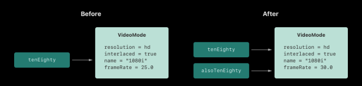

- *구조* 와 *클래스는* 프로그램 코드의 구성 요소가 되는 범용적이고 유연한 구성입니다. 상수, 변수, 함수를 정의하는 데 사용하는 것과 동일한 구문을 사용하여 구조와 클래스에 기능을 추가하는 속성과 메서드를 정의합니다.
- 다른 프로그래밍 언어와 달리 Swift는 사용자 정의 구조 및 클래스에 대해 별도의 인터페이스 및 구현 파일을 만들 필요가 없습니다. Swift에서는 단일 파일에 구조나 클래스를 정의하면 해당 클래스나 구조에 대한 외부 인터페이스가 자동으로 다른 코드에서 사용할 수 있게 됩니다.
-
- 메모
	- 클래스의 인스턴스는 전통적으로 object 라고 알려져 있습니다 . 그러나 Swift 구조와 클래스는 다른 언어보다 기능면에서 훨씬 더 가깝고 이 장의 대부분은 클래스 또는 구조 유형 의 인스턴스에 적용되는 기능을 설명합니다. 이 때문에 보다 일반적인 용어인 인스턴스 가 사용됩니다.
-
- 구조와 클래스 비교
	- 공통점
		- 값을 저장할 속성 정의 (저장프로퍼티 정의)
		- 기능을 제공하는 방법 정의 (메서드)
		- 서브스크립트 구문/문법을 활용한 값에 접근하도록 하는 서브스크립트 정의
		- 초기 상태를 설정하기 위한 초기화 코드 정의
		- 기본 구현 밖의 기능을 확장하도록 제공 (extension)
		- 특정 종류의 표준 기능을 제공하는 프로토콜을 준수합니다. (Protocol) 기능
	- 클래스는 가능하지만 구조체는 가지지 못한 기능은
		- 클래스 상속은 다른 특성을 가진 클래스로부터 계승받을 수 있다. (상속은 클래스 에서만 가능)
		- 타입 캐스팅 (형 변환)은 런타임 시점에 클래스 인스턴스의 형태를 확인하고 해석할 수 있게 한다.
		- 소멸자는 클래스 인스턴스가 할당한 리소스를 해제 할 수 있습니다.
		- 참조 카운팅(Reference counting)은 클래스 인스턴스에 대한 한 개 이상의 참조를 허용한다.
		- 참고
			- 클래스가 지원하는 추가 기능은 복잡성을 증가시키는 대가로 제공됩니다. 일반적인 지침으로, 추론하기가 더 쉽기 때문에 구조를 선호하고 적절하거나 필요할 때 클래스를 사용하십시오. 실제로 이는 정의하는 대부분의 사용자 정의 유형이 구조 및 열거형이라는 것을 의미합니다. 
			  더 자세한 비교를 보려면 [구조와 클래스 사이 선택을](https://developer.apple.com/documentation/swift/choosing_between_structures_and_classes) 참조하세요 .
- 메모
	- 클래스와 액터는 동일한 특성과 동작을 많이 공유합니다. 액터에 대한 자세한 내용은 [동시성을](https://docs.swift.org/swift-book/documentation/the-swift-programming-language/concurrency) 참조하세요.
-
- 구조체와 클래스는 비슷한 정의 구문을 갖습니다. `struct` 키워드가 있는 구조와 `class` 키워드가 있는 클래스를 소개합니다. 
  둘 다 전체 정의를 한 쌍의 중괄호 안에 넣습니다.
- ```swift
  struct SomeStructure {
    // structure definition goes here
  }
  class SomeClass {
    // class definition goes here
  }
  ```
- 메모
	- 새롭게 클래스나 구조체를 선언할 때마다, 하나의 새로운 스위프트 타입을 정의하는 것입니다.
	  타입 이름은 `UpperCamelCase` 를 사용하는 것이 일반적인 스위프트 타입을 선언하는 방법입니다. 
	  프로퍼티 이름은 `lowerCamelCase`를 사용하는 것으로 타입 이름과 차별점을 두는 방법입니다.
-
- ### 구조체와 열거형은 값 타입
	- 값 타입은 그것이 변수나 상수로 선언 될 때 함수에 전달될 때 해당 값이 복사 되는 형태입니다.
-
- 메모
	- (배열, 딕셔너리, 문자열)로 선언된 컬렉션은 복사를 위한 성능 비용을 줄이도록 최적화 되어있습니다.
	  즉시 복사본을 만드는 대신에, 위의 컬렉션들은 원본과 복사본 사이의 요소가 저장된 메모리를 공유한다.
	  컬렉션의 복사본 중 하나가 변경되면, 해당 요소는 수정 직전에 복사됩니다. 
	  따라서, 코드에서 볼 수 있는 동작은 항상 복사가 즉시 발생한 것과 동일합니다.
-
- 열거형 역시 값 형식이다.
	- ```swift
	  enum CompassPoint {
	      case north, south, east, west
	      mutating func turnNorth() {
	          self = .north
	      }
	  }
	  var currentDirection = CompassPoint.west
	  let rememberedDirection = currentDirection
	  currentDirection.turnNorth()
	  
	  
	  print("The current direction is \(currentDirection)")
	  print("The remembered direction is \(rememberedDirection)")
	  // Prints "The current direction is north"
	  // Prints "The remembered direction is west"
	  ```
- `remeberedDirection`는 currentDirection 의 값을 할당할 때, 그 값을 즉시 복사한다. 
  그 이후 `currentDirection`의 값을 바꾼 후에 기존의 값을 복사한 `remeberedDirection`
- When `rememberedDirection` is assigned the value of `currentDirection`, it’s actually set to a copy of that value. Changing the value of `currentDirection` thereafter doesn’t affect the copy of the original value that was stored in `rememberedDirection`.
- 추가로 func 사용 시에 저장된 property를 수정하기 때문에 `mutating` 키워드가 사용 된 것을 확인 할 수 있다.
-
- ### 클래스
- 값 유형과 달리 *참조 유형은* 변수나 상수에 할당되거나 함수에 전달될 때 복사 되지 *않습니다* . 
  복사본 대신 동일한 기존 인스턴스에 대한 참조가 사용됩니다.
  (참조는 일종의 해당 데이터를 저장하는 주소 값을 동일하게 가지는 것과 같습니다.)
- 위에 정의된 클래스를 사용하는 예는 다음과 같습니다 .`VideoMode`
	- ```swift
	  let tenEighty = VideoMode()
	  tenEighty.resolution = hd
	  tenEighty.interlaced = true
	  tenEighty.name = "1080i"
	  tenEighty.frameRate = 25.0
	  ```
	- ```swift
	  let alsoTenEighty = tenEighty
	  alsoTenEighty.frameRate = 30.0
	  ```
- 클래스들은 참조타입이기 때문에 `tenEighty` and `alsoTenEighty` 둘다 같은 VideoMode의 인스턴스를 참조하고 있다. 효과적으로 아래의 형태와 같이 다른 2개의 이름을 가진 하나의 인스턴스로 있는 것이다.
- {:height 179, :width 716}
- 이 예제는 참조 타입이 위와 같이 잘 못 되었는지 추리하는데 어려운 것을 보여준다. 
  만약 `tenEighty`와 `alsoTenEighty` 가 프로그램 코드에서 멀리 떨어져있다면, VideoMode가 바뀐 모든 경로를 찾는 것은 더 어려울 것이다. `tenEighty`를 사용 할 때 마다, `alsoTenEighty`를 사용하는 코드도 같이 생각해야한다. 물론 그 반대도 말이다.
  대조적으로, 값 타입은 소스 파일의 근접하게 같이 있으며 코드끼리 상호작용하기 때문에, 코드가 잘못 되어도 그를 추리하기 비교적 쉽다.
- `tenEighty` 와 `alsoTenEighty` 변수가 아닌 상수로 선언 되었습니다. 그러나 여전히 내부의 프로퍼티인 `frameRate`, `frameRate`는 변경이 가능합니다. 실제로 그 상수의 값들은 변경되지 않았기 때문입니다. 
  두 `tenEighty` 와 `alsoTenEighty` 는 `VideoMode` 의 인스턴스를 저장하지 않습니다. 그 대신 그들의 인스턴스를 참조합니다.
  변경 된 것은 해당 상수 참조의 값이 아니라, `VideoMode`의 `frameRate` 속성이 변경 되었습니다.
-
- 여기서 신원 연산자
	- 클래스는 참조 유형이므로 여러 상수와 변수가 뒤에서 클래스의 동일한 단일 인스턴스를 참조하는 것이 가능합니다. (구조체와 열거형의 경우에는 동일하지 않습니다. 왜냐하면 상수나 변수에 할당되거나 함수에 전달될 때 항상 복사되기 때문입니다.)
	- 두 개의 상수 또는 변수가 정확히 동일한 클래스 인스턴스를 참조하는지 확인하는 것이 유용할 수 있습니다. 이를 가능하게 하기 위해 Swift는 두 가지 항등 연산자를 제공합니다.
-
- === 와 같음
	- 이 연산자는 == 과 다르다. 
	  다른 이유는 ===는 클래스 타입의 두 상수나 변수에서 정확히 같은 클래스 인스턴스를 참조하고 있는지 확인하는 것입니다.
	  ==는 값에서 같음, 같도록 고려된 것을 의미합니다.
- !== 와 다름
-
-
-