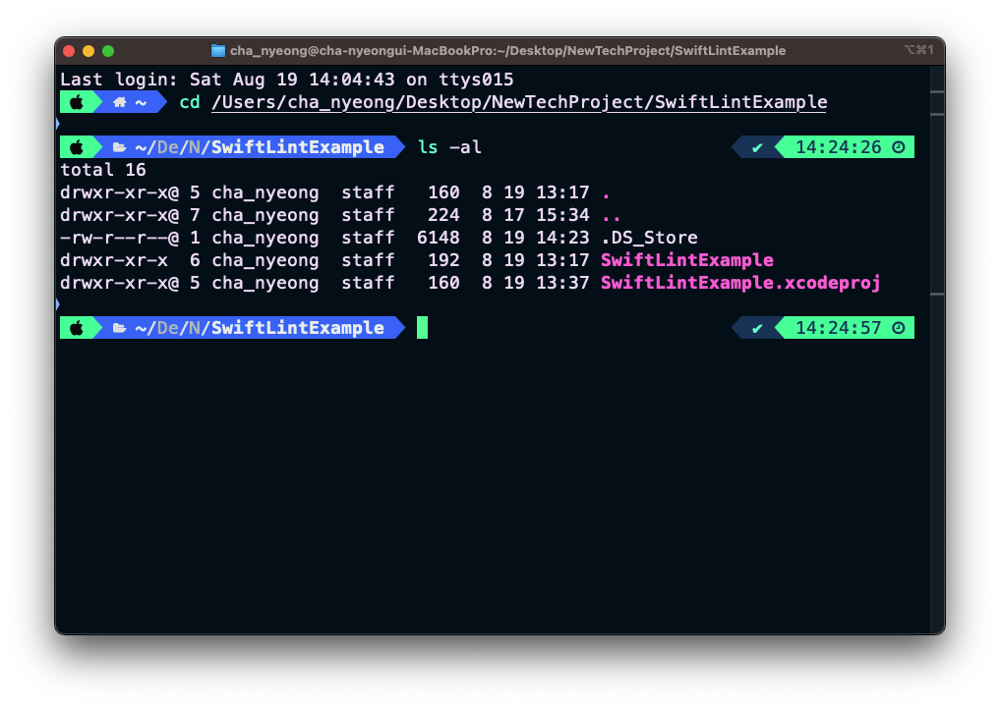

### 설치 방법 :
	- 설치 할 프로젝트를 설정한다.
	  logseq.order-list-type:: number
	- {:height 716, :width 629}
	  logseq.order-list-type:: number
		- 제일 하단의 Frameworks, Libraries, Embedded Content의 + 버튼을 누른다.
		  or Add packages 에서 https://github.com/realm/SwiftLint 주소를 입력해서 다운로드 받는다.
	- Build Phases 
	  logseq.order-list-type:: number
		- 
		- 여기서 Run Build Tool Plug-ins 을 눌러서 내린 이후
		  {:height 433, :width 527}
		- 플러그인을 추가한 다음 빌드를 실행한다.
		  여기서 만약 swiftLInt가 믿을수 없다는 경고창이 발생 시에 Trust 해주면 된다.
	- 빌드 시에 혹시나 블러그인을 찾지 못한다는 경고나 
	  logseq.order-list-type:: number
	  
		- 위와 같은 경고가 발생 할 경우
		- Xcode를 어디에 설치했습니까? 아래에 설치된 경우 `/Applications/Xcode.app`다음을 실행하십시오.
		- 아래와 같은 문구를 Terminal 에서 실행 이후 빌드 진행하니까 정상적으로 진행되었다.
		- ```
		  sudo xcode-select -s /Applications/Xcode.app/Contents/Developer
		  ```
		- 다른 곳에 설치된 경우 `/Applications/Xcode.app`위 명령의 경로를 Xcode를 설치한 위치로 바꿔야 한다.
	- 그 이후에 
	  logseq.order-list-type:: number
	  
		- 와 같이 공백이나 선언 이후에 공백은 한칸만 가능하도록 하는 등의 설정에서 벗어나면 노란색 경고를 알려준다.
		- 추가적으로 
		  
			- 강제 형 변환에 대한 사항은 오류로 처리 해준다. 
			  따라서 이에 대한 커스텀 사항에 대한 처리가 필요하다.
- ### SwiftLInt Rule 설정 방법:
	- 설치 된 프로젝트 파일에 접근한다.
	  logseq.order-list-type:: number
		- {:height 411, :width 600}
	- https://github.com/realm/SwiftLint 페이지 접근해서 Configuration을 확인하면 Lint에 대한 설정 값을 `.swiftlint.yml` 파일로 관리한다.
	  logseq.order-list-type:: number
	  따라서 해당 파일을 ``touch .swiftlint.yml ``으로 생성해준다.
	  Tip ) 숨김 파일이 파인더에서 안보이면 cmd + Shift + . 을 누르면 보인다
	- 나머지는 설정 값을 보고 원하는 형태로 만들어 주면 되는데
	  logseq.order-list-type:: number
	  ```yaml
	  # By default, SwiftLint uses a set of sensible default rules you can adjust:
	  disabled_rules: # rule identifiers turned on by default to exclude from running
	    - colon
	    - comma
	    - control_statement
	  opt_in_rules: # some rules are turned off by default, so you need to opt-in
	    - empty_count # find all the available rules by running: `swiftlint rules`
	  
	  # Alternatively, specify all rules explicitly by uncommenting this option:
	  # only_rules: # delete `disabled_rules` & `opt_in_rules` if using this
	  #   - empty_parameters
	  #   - vertical_whitespace
	  
	  analyzer_rules: # rules run by `swiftlint analyze`
	    - explicit_self
	  
	  included: # case-sensitive paths to include during linting. `--path` is ignored if present
	    - Source
	  excluded: # case-sensitive paths to ignore during linting. Takes precedence over `included`
	    - Carthage
	    - Pods
	    - Source/ExcludedFolder
	    - Source/ExcludedFile.swift
	    - Source/*/ExcludedFile.swift # exclude files with a wildcard
	  
	  # If true, SwiftLint will not fail if no lintable files are found.
	  allow_zero_lintable_files: false
	  
	  # configurable rules can be customized from this configuration file
	  # binary rules can set their severity level
	  force_cast: warning # implicitly
	  force_try:
	    severity: warning # explicitly
	  # rules that have both warning and error levels, can set just the warning level
	  # implicitly
	  line_length: 110
	  # they can set both implicitly with an array
	  type_body_length:
	    - 300 # warning
	    - 400 # error
	  # or they can set both explicitly
	  file_length:
	    warning: 500
	    error: 1200
	  # naming rules can set warnings/errors for min_length and max_length
	  # additionally they can set excluded names
	  type_name:
	    min_length: 4 # only warning
	    max_length: # warning and error
	      warning: 40
	      error: 50
	    excluded: iPhone # excluded via string
	    allowed_symbols: ["_"] # these are allowed in type names
	  identifier_name:
	    min_length: # only min_length
	      error: 4 # only error
	    excluded: # excluded via string array
	      - id
	      - URL
	      - GlobalAPIKey
	  reporter: "xcode" # reporter type (xcode, json, csv, checkstyle, codeclimate, junit, html, emoji, sonarqube, markdown, github-actions-logging, summary)
	  ```
	- 해당 하는 값을 확인해서 규칙에 대한 값을 설정 해주면 되겠다.
	  logseq.order-list-type:: number
	  예시로는
	  ```yaml
	  force_cast : warning #implicitly
	  //이런 형식으로 쓰면 ! (강제 형변환 시도) 할 경우에 
	  Lint의 기본 값은 error -> warning 으로 변경 되도록 가능하다.
	  ```
-