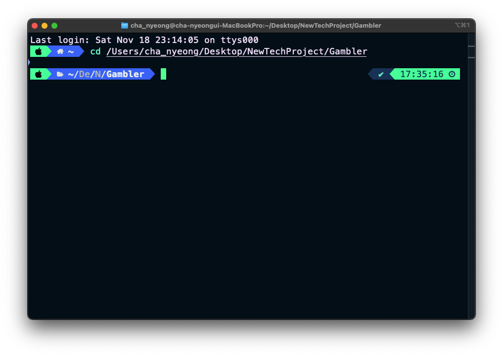
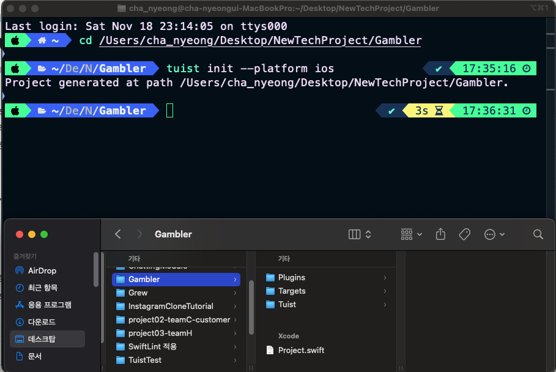
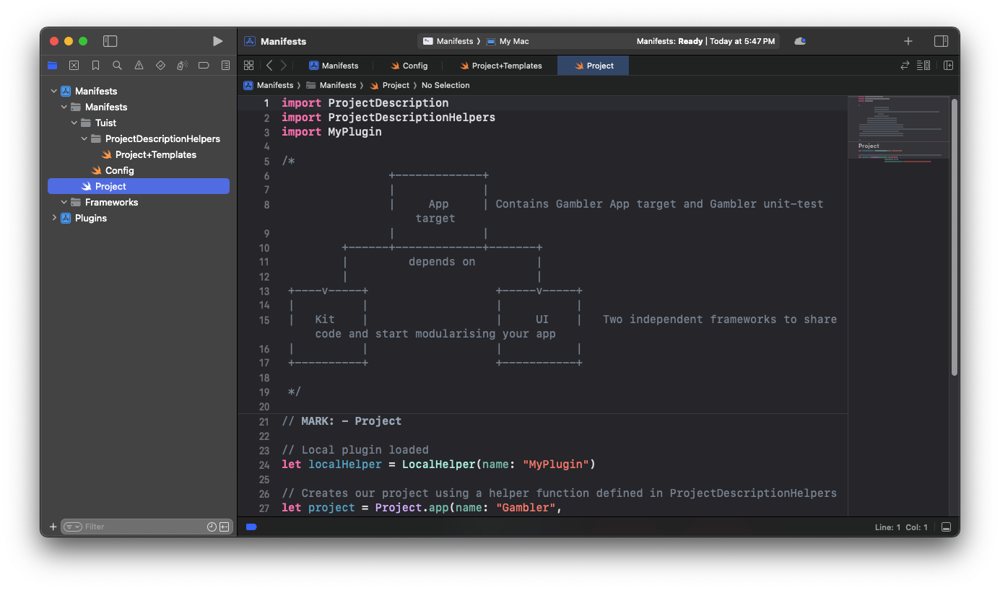

## [[Tuist]]
- 1. 일단 빈 프로젝트로 사용 할 폴더를 만듭니다.
- {:height 349, :width 460}
- 2. 해당 폴더 안에서 `Tuist init` 하여 tuist 구조를 생성합니다.
- 
- 기본 뼈대인 Plugins / Targets / Tuist 폴더 + Project.swift 파일이 생성 되었습니다.
- 3. `Tuist Edit`이라고 입력하면 Tuist를 통해 프로젝트를 설정할 수 있는 페이지가 나옵니다.
- 해당 Manifests 파일을 수정하면 되는데. 이는 [[Tuist]] 페이지를 참조 하도록 하자.
- 
- 위와 같이 프로젝트가 생성되는걸 확인 할 수 있다.
- 이후 부터는 Xcode에 맞게 실제 모듈 구조를 생성해야 하는데 이를 알기 위해서는 Xcode에 대한 구성 요소를 알아야 할 필요가 있다.
- [[draws/2023-11-22-18-16-04.excalidraw]]
- 의 형태를 가지고 있다고 생각하면 이해하기가 쉽다.
- 물론 저 Target 안에도 이름, 플랫폼, 이름, 번들 Id 등등 기입에 필요한 값들을 지정해줘야 한다.
- Test를 하기 위해서는 별도로 testTarget을 빼두었고, appTarget을 dependency로 가져야 합니다.