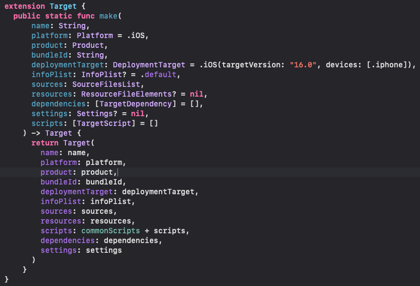

## [[Tuist]]
- ProjectDescriptionHelpers -> Extension을 관리하는 공간
  logseq.order-list-type:: number
	- ? 뭔소리임 Extension을 Tuist edit에서 뭐하러 관리함
	  logseq.order-list-type:: number
		- Tuist에서 여러 개의 프로젝트를 생성해야 한다.
		- 따라서 이를 편리하게 관리하기 위해서 즉 생성해서 넣기 위해서는 중복 된 값들이 많다. ex) OrganizationName 이라던지 추후에 Infoplist가 중복으로 사용 된다던지, 우리 프로젝트에 꼭 들어가야하는 패키지나 Scheme 정보를 일괄적으로 make나 생성하는 generate 함수를 Extension에 생성하여 프로젝트를 보다 쉽게 만드는 것이다.
	- 이밖에 Target도 여러 프로젝트에서 생성되는 사항을 인지해야한다.
	  logseq.order-list-type:: number
		- Target도 여러 개가 비슷한 속성으로 생성 될 수 있다.
		- 
		- 이와 같이 기본 값으로 IOS 버전을 설정, 혹은 iPad를 사용하지 않고 iPhone 만을 사용한다거나 이 타겟은 모든 프로젝트에서 동일할 확률이 매우 높다. 또한 Infoplist도 default로 기본 값으로 생성 해둔다면 이후에 추가된 사항에서만 정리를 진행하면 될 것이다. (왜냐하면 Tuist에서는 우리가 기본적으로 Xcode에서 설정되는 Info.plist가 제공되지 않기 때문이다.)
	- 추가로 TargetDependency에서는 자주 사용되는 TCA / AF 등 많은 모듈화를 진행시 나뉘게 되는 패키지에 대한 사항을 쉽게 컨트롤하기 위해
	  logseq.order-list-type:: number
- 앱이 진행중간에 기능을 추가하거나
  logseq.order-list-type:: number
	- https://sarunw.com/posts/tuist-scaffold/ 분석 후 공유
	  logseq.order-list-type:: number
	- logseq.order-list-type:: number