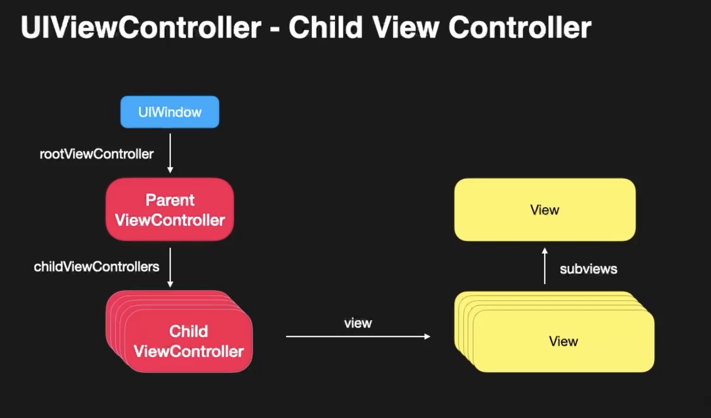
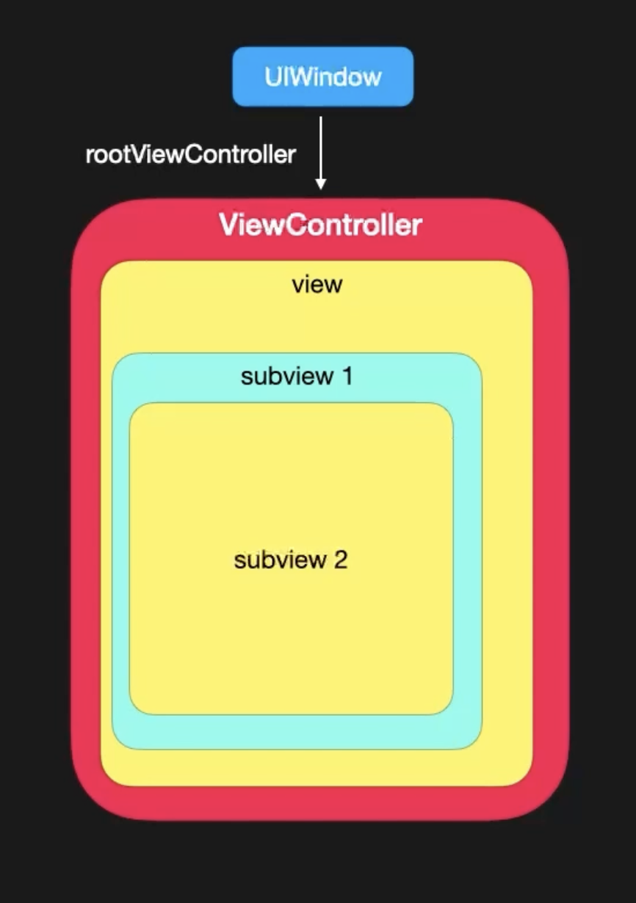

- 
- View
	- frame과 bounds로 뷰의 위치를 표현
		- 뷰의 좌표계 : x, y, width, height
		- frame: super view로 부터의 상대적인 위치
		- bounds: frame을 기준으로 view를 rendering할 위치 
		  일반적으로 bounds의 x,y좌표는 0
	- 디테일한 처리는 layer에서 담당
		- View는 n개의 layer를 가질 수 있고, Layer를 통해서 곡면 표현 혹은, 외곽선 등의 디테일한 뷰의 처리를 해줄 수 있습니다.
		- view.layer.cornerRadius
		- view.layer.borderWidth
		- view.layer.borderColor 등..
	- Layout 및 subview 관리
		- n개의 subview를 추가 제거 가능
		- 그 subview를 layout 할 수 있음
		- View의 크기 혹은 bounds가 변경 될 때 layoutSubViews 메소드가 불리게 되고,
		  이를 override 하여 화면 변화에 따른 layout을 재조정 할 수 있음.
		- 이러한 layout 재조정을 AutoLayout을 통해 자동화 할 수 있음.
	- 주의 사항 : View의 접근은 반드시 main Thread에서 이루어져야 하며, 다른 Thread에서 접근 시 의도하는 대로 동작하지 않을 수 있음.
- View의 이벤트 전달 Chain
	- Responder Chain
	- {:height 379, :width 244}
	- subview2를 눌렀을때 이벤트가 일어나지 않으면 subview 1 -> view -> ViewController -> UIWindow 까지 오게 됨.
- Event handling
	- UIResponder의 touch 메소드 override
	- UIControl을 상속한 컴포넌트들을 활용
	- UIGestureRecognizer 추가.
- Controls
	- User Interaction에 반응하는 action들을 전달
	- UIButton, UISlider, UISwitch 등 User Interaction이 일어나는 컴포넌트들이 UIControl을 상속하고 있음.
-
- User Interaction을 제어에 관한 사항만 인지 부탁 바람.
	- 어떻게 하는데?
		- Show Inspector -> View -> Interaction -> User Interaction Enabled를 끄면 해당하는 버튼 뒤의 사용자 인터렉션이 이뤄짐.
		- 코드에서 진행시에는 .isUserInteractionEnabled = false로 끌 수 있음.
-
- 스토리보드로 진행
-
- 피그마에서 리소스 추가 하는 방법!
	- 이미지의 경우 최상단의 이미지를 클릭 한 다음 우측 최하단의 Export 작업을 해주어야 함.
-
- AutoLayout?
	- 뷰의 위치, 크기를 constraint를 이용하여 정의.
	- 다양한 Device 환경에 대한 대응 가능
	- AutoLayout이 제대로 동작하기 위해서는 x, y 좌표 그리고 width, height에 대한 정의가 필요