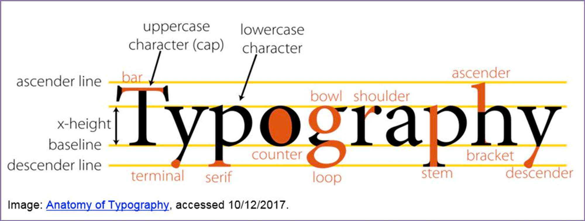
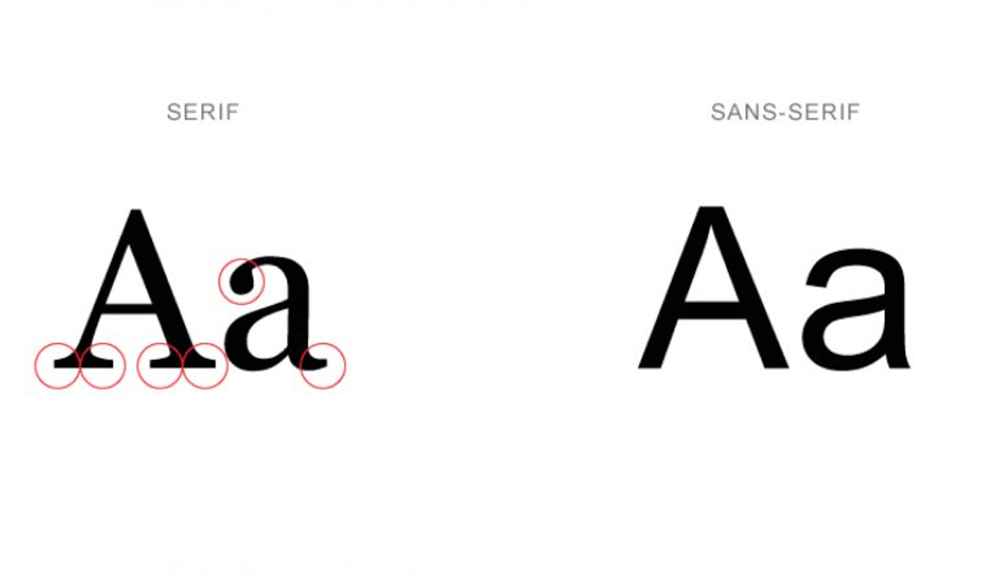
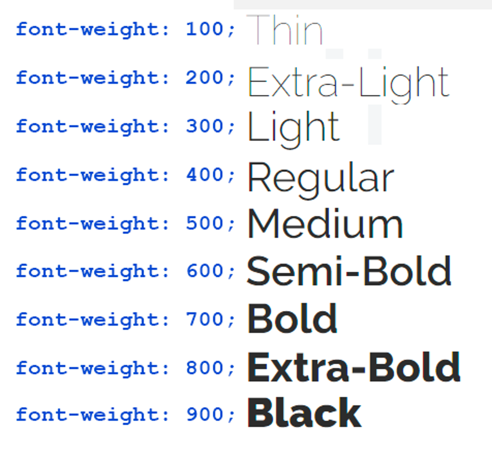
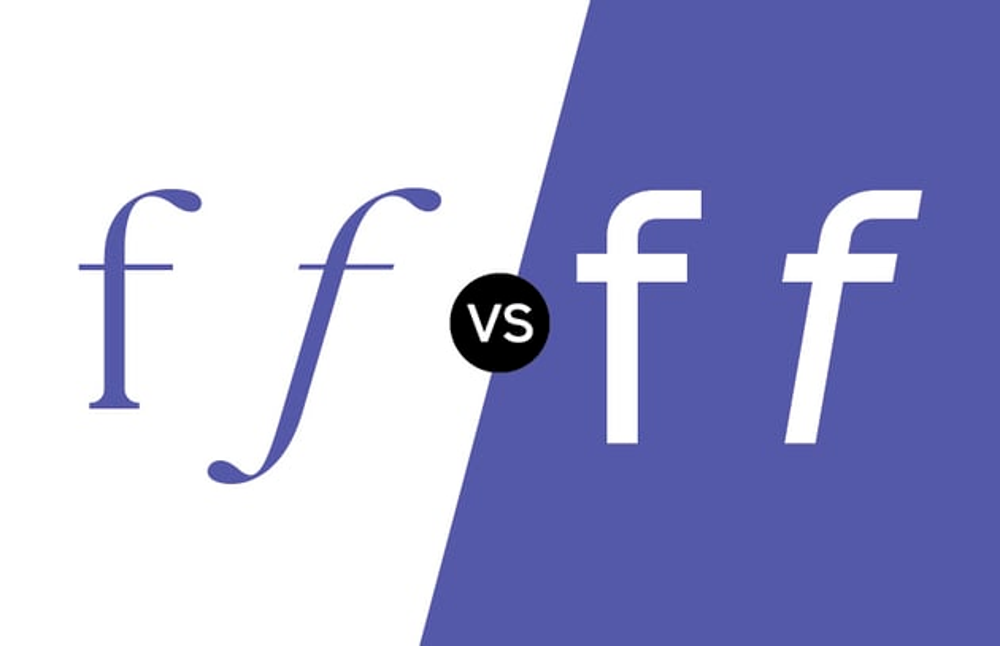
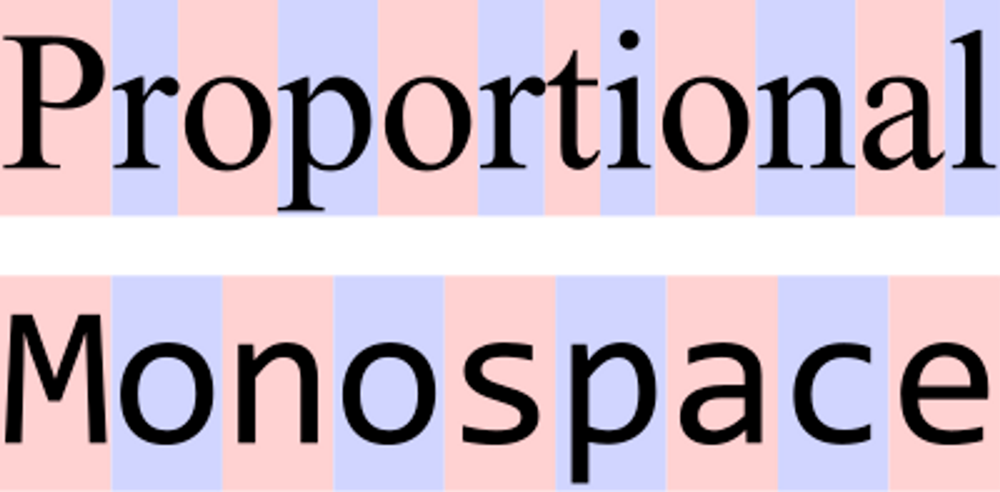
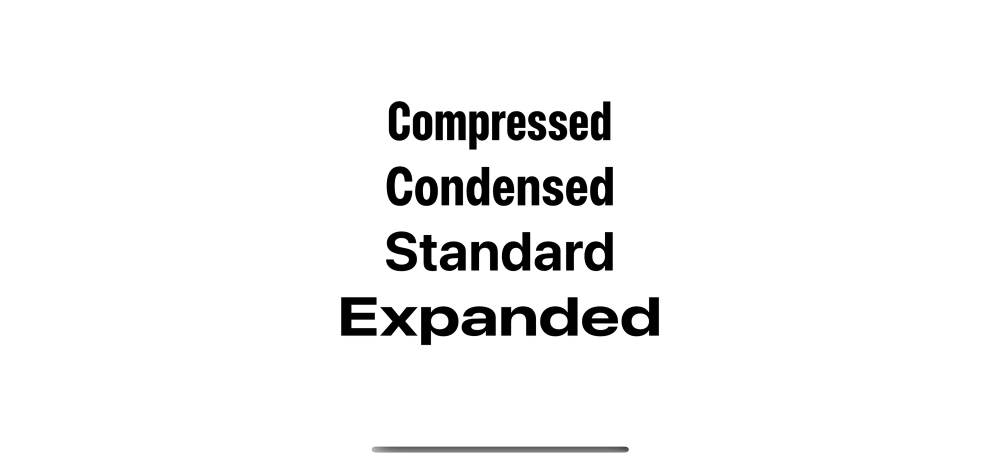
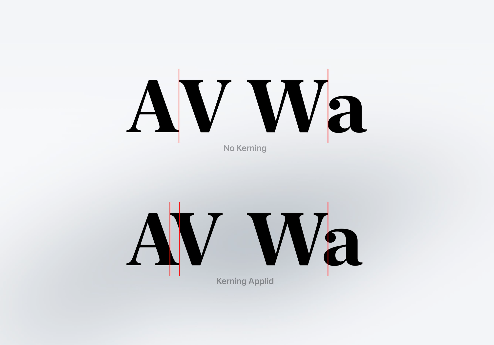
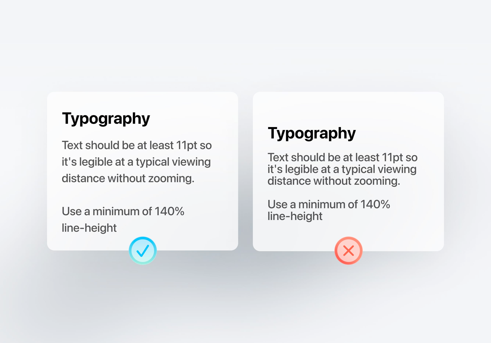
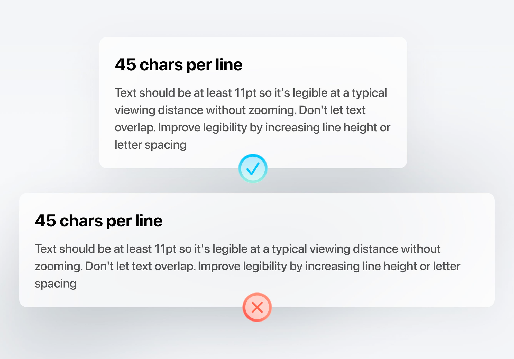

- # #Design (Typography)
-
- ## Typography 타이포그래피란?
	- 글씨(글자)를 다루는 기술의 통칭
	- 고전적인 의미로는 글을 쓰는데 있어 인상을 주는 의미
	- 모던 디자인에서의 의미로는 글씨를 다루는 법을 의미
-
- ## #Anatomy_of_Type
	- 
	- Baseline : 글자에서 바닥 지점이 되는 기준선
	- X-height: 글자에서 소문자 x가 가지는 높이로, Baseline과 최상단의 높이
	- Descender: X-height의 아랫부분
	- Ascender: X-height의 윗부분
-
- ## #TypeFace
	- {:height 251, :width 479}
	- 느낌과 인상이 비슷한 글자들의 모임
	- 주로 글꼴, 글자체, 서체
	- Sans Serif(고딕) / Serif(경조)로 나뉜다
	-
- ### #TYPEFACE vs #FONT
	- TypeFace: 글자의 형태나 스타일 및 느낌으로, 글자의 모양, 생김새, 인상 등을 의미한다.
	- Font: 한 스타일의 낱글자를 한데 모아놓은 묶음(파일)
	- FAMILY: 한 타입스페이스 안에 있는 동일한 글자의 스타일을 묶어둔 것을 의미
-
- ## #WEIGHT
	- {:height 342, :width 313}
	- 글자의 무게(두께)를 의미함
	- 글씨의 두께가 가는 것일수록 가볍다고 느끼고, 두꺼울수록 무겁다고 느낌
	- 두껍고 클 수록 제목과 주목될 키워드에 사용하고 얇을 수록 본문에 적합함.
-
- ## #SIZE
	- Ascender의 맨 위와 Descender의 맨 아래 사이의 길이
-
- ## #ITALIC / #OBLIQUE
	- {:height 283, :width 456}
	- Italic: 디자이너가 특정 기울여진 모양을 따로 디자인해 만든 기울임 스타일 (왼쪽)
	- Oblique: 글자의 원형 그대로 기울여 만든 기울임 스타일                           (오른쪽)
-
- ## #MONOSPACE ↔ #Proportional
	- {:height 244, :width 467}
	- MONO(단위) + SPACE(공간)
	- 글꼴 안의 각 낱글자 폭이 모두 동일한 스타일
	- 글자당 차지하는 공간을 같게 하는 형태
-
- ## #CONDENSED
	- {:height 259, :width 494}
	- 같은 비율에 전체 글자 폭을 동일 비율로 압축한 형태
	- 한 줄에 많은 내용이 들어가야 하는 상황에서 공간 절약을 할 수 있는 점에서 유리함
	-
- ## #Typography 를 배우는 목적 #why
	- Readability(가독성)
		- 텍스트를 읽고 이해하기 쉬운 정도
	- Legibility(이독성)
		- 개별 글자를 판독하기 좋은 정도
-
- ## #Kerning
	- {:height 300, :width 404}
	- 자간
	- 글자 간의 간격으로 글자 자체의 형태 변화는 없음
-
- ## #Leading
	- {:height 334, :width 413}
	- 행간
	- Baseline - Baseline의 사이
-
- ## [[LINE LENGTH]]
	- {:height 457, :width 547}
	- 글 줄 길이
		- 한 줄에 30~50글자가 적당하다.
	-
-
- ## PURPOSE(글꼴의 용도 지키기)
	- 헤드라인용
		- 사람의 시선을 잡아 끌기 위한 글꼴
		- 짧은 글자수의 제목글에서 시선을 사로잡기 위해 특징이 두드러진 글꼴을 사용할 것
	- 본문용
		- 정보를 얻기 위한 글꼴
		- 한 문장 이상의 본문글에서 긴 글을 읽는 데 무리가 없도록 가독성/이독성이 높이 디자인된 글꼴을 사용할 것
-
- {{embed [[https://designcode.io/ios-design-handbook-typography-and-dynamic-type]]}}
-
- ## [[Basic Principles]]
	- Spacing Rule
		- 글자 사이 < 글 줄 사이 < 문단 사이
	- Sizing Rule
		- 본문 < 중제목 < 대제목
-
-