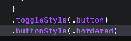

## [[Swift Charts]]
-
- ## [[NavigationStack]]
	- 이번에 새로 배웠던 NavigationLink(value: ) + NavigationDestination을 통한 구현
	- NavigationPath를 설정하면 rootView 부터 쌓이는 처리
- ## [[NavigationSplitView]]
	- 주로 padOS 에서 사용
- ## [[Scene]]
	- App 관련해서 멀티 창 구현 및 관리에 대한 부분
-
- ## [[Form]]
	- Section / Control
	- LabeledContent
	- 장점 : 멀티 플랫폼에서 사용 되는 정말 좋음
- ## [[Control]]
	- Textfield (axis : 설정) 으로 늘어남에 따라서 해당 축에 늘어남 + 줄 제한도 가능 (5...10) 과 같이 범위 설정도 가능
	- MuitiDatePicker : 다중 날짜 선택
	- DisclosureGroup : 토글 그룹
	- Toggle도 그냥 끄는 스타일이 아닌 버튼, border 스타일로도 가능 
	  
	- Stepper : 스태퍼 기능을 사용 가능.
	- accessibilityQuickAction 을 사용하여 주먹을 쥐는 등, 기능을 했을때 처리 될 사항
	- Table 과 toolbar
	- searchable + token을 통한 검색어 구축 제안도 가능하다.
-
- ## [[PhotosPicker]]
	- 라이브러리에서 사진이나 영상을 선택
	- 
-
- ## [[ShareLink]]
	- 앱 안에 시스템 공유 시트 기능이 생김
-
- ## [[Transferable]] 프로토콜
	- dropDestination, payloadType
	- String, Data, URL, Attributed String, Image
	- 
	- 커스텀 Transferable 프로토콜을 채택해서도 사용가능하다.
-
- ## [[Shape Style]]
	- {:height 334, :width 715}
	- SF symbol과 그림자, 그라데이션을 활용하면 아이콘 제작이 쉽다
	- 애니메이션도 가능 + 텍스트도 토글 값 처리처럼 두께, 폰트, 스타일, 레이아웃등을 빠르게 변화 시킬 수 있고 추가로 애니메이션 적용도 가능하다.
	- 
	-
- ## [[Geometry]] [[Layout]]
	- Grid (view) / GridRow, GridColumn 의 활용으로 가능
	- Layout Protocol을 채택하면 어떻게 쓸수 있는지?
		- https://developer.apple.com/videos/play/wwdc2022/10056 이거보셈ㅋ
	-