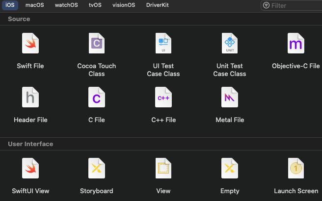
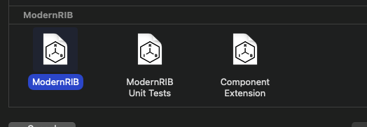

## Xcode Template 생성
- https://zeddios.tistory.com/930 -> 커스텀 템플릿 생성하기
- 커스텀 파일 템플릿은 신규로 Xcode에서 파일을 추가할 때 원하는 형태의 파일을 생성하도록 설정하는 파일, 
  
  ex) 
- 의 상단처럼 선택을 할 수 있는 사항은 결국 저 해당하는 템플릿의 형태 코드가 제공 되었기 때문임. 따라서 이를 변경하거나 작성이 가능함.
- 관련해서 [[Modern RIBs]] 패턴을 습득하면서 해당 라이브러리의 기능 중에 템플릿을 추가하여 하단의 RIBs 형태의 파일 템플릿을 추가함.
- 
- 추가적으로 sh script로 실행이 가능하며 쉘 스크립트의 실행은 sh (파일명) 으로 함