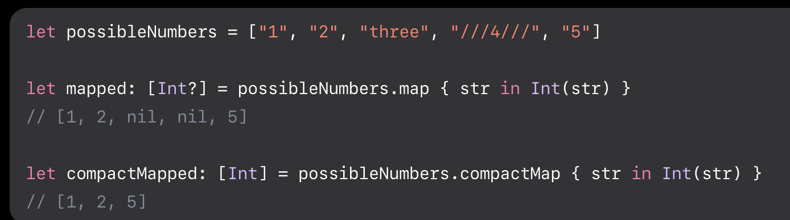

- #+BEGIN_QUOTE
  Returns an array containing the non-nil results of calling the given transformation with each element of this sequence.
  #+END_QUOTE
- 
- 이와 같이 compactMapped는 옵셔널이 나오지 않으며 nil에 대한 처리와 더불어 2차원 배열 (배열 속 배열을 처리 함에 있어도 동일하게 유지시키면서 처리함.)