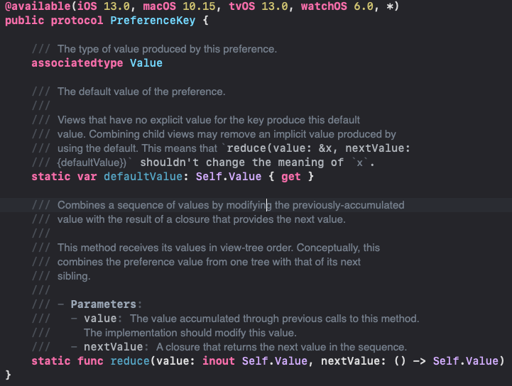

- #+BEGIN_QUOTE
  key와 value로 구성된 데이터 전달 메소드
  데이터 전달: 하위 뷰 -> 상위 뷰
  
  <-> 기존의 바인딩, 인자로 넘겨주는 것이 아닌 하위 뷰에서 상위 뷰로의 데이터 전달을 목적으로 하는 키, 값을 전달
  
  "자식이 여러 개인 보기는 주어진 기본 설정에 대한 값을 조상이 볼 수 있는 단일 값으로 자동 결합합니다." 라고 되어 있음
  
  
  #+END_QUOTE
- https://developer.apple.com/documentation/swiftui/preferencekey/
- {:height 382, :width 480}
	- 프로토콜로 연관 값은 Value를 가진다.
	- defaultValue
	- reduce(value: nextValue:)
		- 이전에 누적된 값을 다음 값을 제공하는 클로저의 결과로 수정하여 일련의 값을 결합합니다. 이라고 한다. 즉 여기서 값을 누적해서 탭 인디케이터를 설정하기 위해서 사용함
-