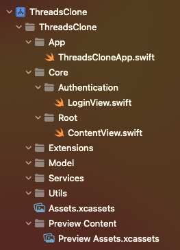
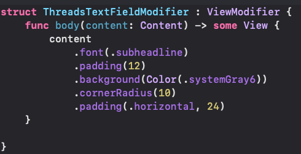
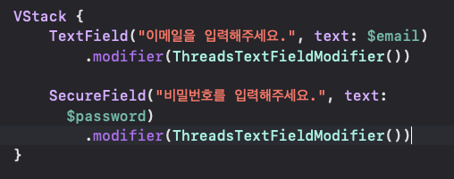
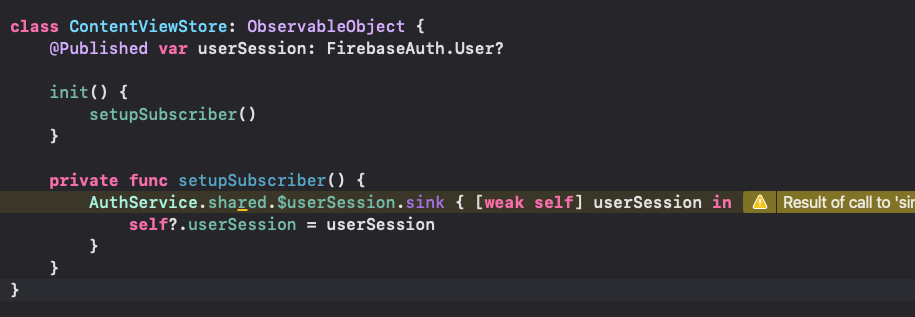
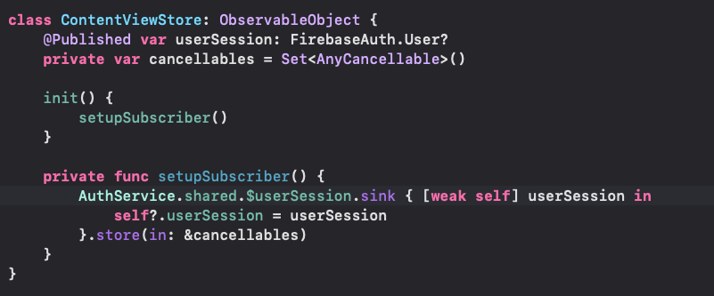
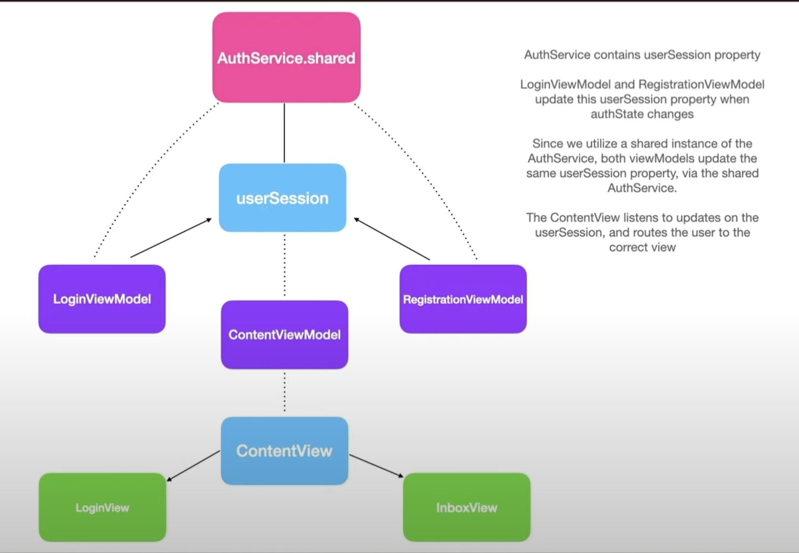

## 1. 프로젝트 세팅
	- iOS -> SwiftUI 
	  logseq.order-list-type:: number
	- Group 설정 ( 옵션 + 커맨드 + N -> 그룹(폴더) 생성 / 커맨드 + N -> 파일 생성 )
	  logseq.order-list-type:: number
	  옵션 + 오른쪽 방향키 열면 하위에 있는 모든 폴더 쫘르륵 열림ㅋ 개꿀
	- 
	  logseq.order-list-type:: number
	  와 같이
	  App 은 시작 부분
	  Core는 주요 기능
	  Extensions 는 나뉨
	  Model 모델
	  Services 
	  Util은 추후 추가
- ## 2. 인증 UI 구현
	- 인증 UI 구현 중의 [[ViewModifier]] 등장 
	  logseq.order-list-type:: number
	  기능으로는 비슷하게 생긴 디자인 및 View 생성시 해당 바디의 수정자를 몰아서 사용할 수 있도록 만든 함수.  
	  
	  body( content : ) 에서 content에 수정자를 적용 시키는 방식으로 진행
	  적용하는 방법으로는 해당하는 View의 .modifier(생성한 ViewModifier를 적용시킴)
	  
	- #TextField - 첫 글자를 자동으로 대문자로 설정하는 기능 비활성화 하기 위함.
	  logseq.order-list-type:: number
	  `` .textInputAutocapitalization(.none)``
	- 자동 맞춤법 수정 비활성화
	  logseq.order-list-type:: number
	  ``.disableAutocorrection(true)``
	- 텍스트 필드 rounded 윤곽선 표출
	  logseq.order-list-type:: number
	  ``.textFieldStyle(.roundedBorder)``
- ## 3. 탭바 설정
	- 탭뷰 설정 이후에 Core 하위에 그룹 설정 + View 설정 해서 탭 아이템 설정과 이미지 설정
	  logseq.order-list-type:: number
- ## 4. Feed 뷰 UI
	- 보이는 그대로 View 설정하고 Cell로 분할 하여 사용
- ## 5. 사람 Explore View UI
	- searchable / Cell 과 컴포넌트로 해당 뷰를 추출 해서 뷰 UI를 구성함
- ## 6. ProfileView UI
	- 프로필 뷰는 뷰 구성하듯 동일하게 구성함
- ## 7. Edit Profile UI
- ## 8. Thread 생성 UI
- ## 9. Firebase Setup
	- 제일 중요한 사항으로는 Firestore / Firestorage 의 지역설정과 더불어 Rules에 들어가서 규칙 부분에서 날짜 변경을 진행해야 함. + firebase ios sdk 사용 시 사용할 패키지 추가가 중요하다. 
	  +) firebasefirestore swift 같은 경우 사용하는 codable 같은 기능들이 추가 되어있음
- ## 10. Firebase Auth
	- 여기선 ViewModel / Service 파일로 제작하여 사용 하였으며 데이터 통신을 위한 싱글톤 패턴을 사용함
	  주요 코드로는 
	  ```swift 
	  Auth.auth().createUser(withEmail: email, password: password)
	  ```
	- Auth 할때 비동기 처리를 해야 하며 추가적으로 #@MainActor + async + throws 함수를 통해서 진행
- ## 11. 로그인 / 로그아웃
	- {:height 186, :width 515}
	- 앱 실행시에 [[Combine]] sink 개념으로 구독하여 사용한다.
- ## 12. 로그아웃 시
	- 
		- cancellable 잘 모르겠음 확인해야함.
- ## 13. User Service / Model
	- 유저 인증 분석
		- 
			-
- ## 14. 사용자 프로필 업데이트 하기
	- AuthService에서 인증 받은 여부 값을 각 페이지의 ViewModel에서 전달 받고 해당 하는 값을 sink받아서 같은 값을 처리 하도록 함. 따라서 프로필 인증 값이 있는 경우 해당 페이지에 값을 담고와서 뿌려주는 형식으로 진행
- ## 15. 친구 뷰 구현
	- 어우 정리가 안된다 나중에 코드 보고 주요 코드 보고 진행
- ## 16. 프로필 네비게이션 + 리팩토링
- https://youtu.be/MfwdchNNW78?t=10703
-