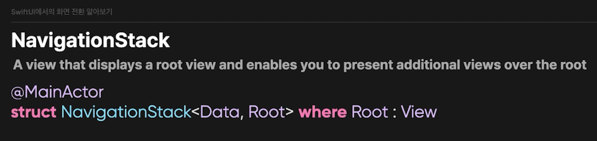
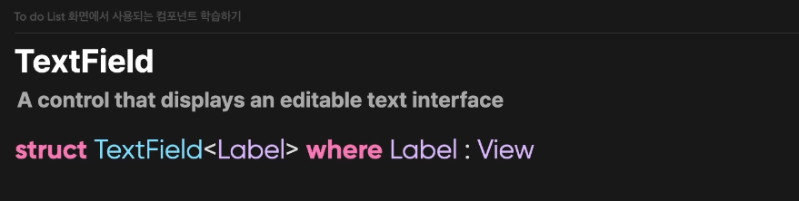
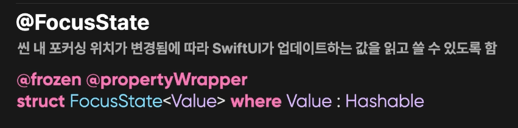
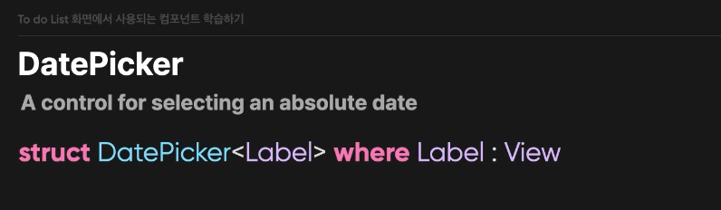
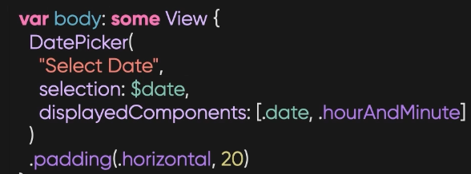
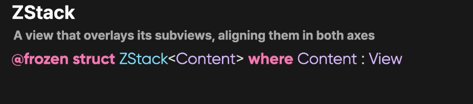
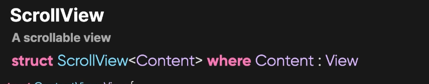
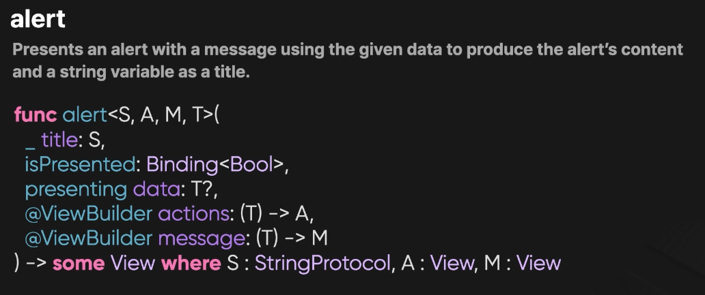

- XCode 15부터 Asset에 들어가는 Color를 넣으면 해당하는 부분이 자동으로 생성 되어서 별도로
- Extension을 추가하지 않아도 자동적으로 static var로 선언 됨.
-
- [[NavigationStack]]
	- 
- 네비게이션 스택으로 상태 관리하기
	- 메인 액터! 라는것 즉 메인 스레드에서 구동함.
	- 따라서 화면 전환이 이뤄진다(?)는 작업은 제일 우선적으로 진행 함.
-
- TextField 컴포넌트
	- {:height 137, :width 509}
	- 라벨 형태를 제네릭하게 받는 형태
- @FocusState
	- 씬 내 포커싱 위치가 변경됨에 따라 SwiftUI가 업데이트 하는 값을 읽고 쓸 수 있도록 함
	- {:height 134, :width 509}
	- enum : hashable 을 활용하여 이동시켜서 UX개선도 가능함.
- DatePicker
	- 특정 날짜를 선택하게 하는 컨트롤
	- 
	- 
	- displayedComponents 에서 날짜 / 시분 지정이 가능함.
- DatePickerStyle
	- compact
	- graphical
	- wheel
	- automatic
	- field (macOS)
	- stepperField (macOS)
- ZStack
	- 하위뷰의 겹쳐서 표현하고, 이를 축에 따라 정렬한다.
	- 
-
- ZStack과 overlay
	- Zstack = zIndex를 통해 이에 대한 순서를 설정하여 겹쳐서 (overlay) 시켜서 뷰를 관리하는 편임.
	- overlay는 Zstack / ZIndex와는 관계가 없음 그저, 접근자 위에 쌓이게 되는 형식의 오버레이 이다.
- ScrollVIew
	- 스크롤뷰는 하위 컨텐츠를 담는 스크롤 되는 뷰
	- 
	- 3요소 = Content (내용) / axes (축) / showIndicators (인지)
- Rectangle
	- Shape 프로토콜을 따르는 뷰의 정렬
- Divider
	- 구분선의 기능이 있기 때문에, 1 height의 구분선이 존재.
- 따라서 Rectangle이 더 커스텀하게 사용이 가능함.
-
- Alert
	- 메시지를 보여주는 경고 창을 띄워줌.
	- 
	- isPresented 값을 활용해서 on/off 작업
	- presenting 을 통한 넘겨줄 데이터 처리 진행
	- actions/messages 후행 클로저로 액션과 메시지를 담을 수 있음. 앞에 presenting으로 들어온 제네릭 T 데이터를 가공해서 처리 할 수 있음.
	- title 표시할 타이틀 (StringProtocol)
-
- Scalable Vector Graphic (svg) = 벡터 특) 파일이 깨지지 않음.
-